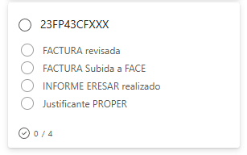

# INTRODUCCIÓN

Algunas formaciones realizadas en cursos anteriores han tenido problemas en el pago por diferentes motivos. Normalmente los motivos son que no han estado correctamente justificados los pagos porque el pago no se ajustaba a la normativa vigente o porque no se han aportado los documentos necesarios para justificar el pago.

!!! advertencia "ATENCIÓN"
    Es muy importante que se sigan las instrucciones que se indican en este documento para evitar problemas en el pago de los ponentes y tutores de la formación en las formaciones. Hay que tener sentido común y aplicar el principio de prudencia en la gestión de los recursos públicos. Hemos de partir de la base que todo pago realizado se debe realizar según la normativa vigente y que se debe justificar documentalmente.

!!! warning "IMPORTANTE"
    Toda la documentación que vamos a ver en este documento se encuentra en la [CARPETA ERESAR del CEFIRE de FP]( {{enlaces.carpeta_eresar}} ){ :target="_blank" }.

## Distribución de formaciones

Todas las formaciones se han distribuido en el [siguiente documento]( {{enlaces.full_calcul_eresar}} ){ :target="_blank" }.

Hay que tener en cueta:

* Se trabajará por parejas de asesores dande soporte el uno al otro
* El asesor asignado 1 será el responsable de la gestión y coordinación del informe
* Los asesores podrán ser reasignados en función de las necesidades de la formación o de la carga de trabajo

## Normativa vigente

Lo primero que debemos tener en cuenta és qué normativa se aplicaba en el momento de la realización de la formación. Por eso, según los diferentes cursos que nos encontremos podemos tener las siguientes situaciones:

* Si la formación se ha realizado entre el 15 de diciembre de 2020 y 31 de diciembre de 2023 se aplica la [siguiente tarificación](https://gvaedu.sharepoint.com/:b:/r/sites/Section_46402871-C/Documentos%20compartidos/CEFIRE%20FP%2025-26/ERESAR/PLANTILLA%20i%20DOC/Tarifas%2015%20DIC%202020%20DE%20LA%20SDGFP%20(2020%20a%20dic%202023).pdf?csf=1&web=1&e=3ejMDH){ :target="_blank" }.

| Modalidad        | Tipo                                                       | Tarifa      | Observaciones                                                               |
|------------------|------------------------------------------------------------|-------------|-----------------------------------------------------------------------------|
| SÍNCRONA         | Con elaboración de materiales                              | 65 €/hora   | Sólo primera edición. Cesión y citación de autoría obligatoria.             |
| SÍNCRONA         | Sin elaboración o cesión de materiales                     | 55 €/hora   |                                                                             |
| ASÍNCRONA        | Tutorización con elaboración de materiales (≤30 part.)     | 55 €/hora   | Sólo primera edición. Cesión y citación de autoría obligatoria.             |
| ASÍNCRONA        | Tutorización con elaboración de materiales (>30 part.)     | 65 €/hora   |                                                                             |
| ASÍNCRONA        | Tutorización sin elaboración de materiales (≤30 part.)     | 45 €/hora   |                                                                             |
| ASÍNCRONA        | Tutorización sin elaboración de materiales (>30 part.)     | 55 €/hora   |                                                                             |
| ASÍNCRONA        | Elaboración de materiales sin tutorización                 | 15 €/hora   | Cesión de materiales. Citación de autoría obligatoria para otros usos.      |

* Si la formación se ha realizado des del 26 de febrero de 2024 se aplica la [siguiente tarificación](https://gvaedu.sharepoint.com/:b:/r/sites/Section_46402871-C/Documentos%20compartidos/CEFIRE%20FP%2025-26/ERESAR/PLANTILLA%20i%20DOC/Tarifas%2026%20febrero%2024_%20Nuria%20soler.pdf?csf=1&web=1&e=vdnyJt){ :target="_blank" } que resuminos en la siguiente tabla:

| Modalidad         | Tipo                                                         | Tarifa                | Observaciones                                                                                   |
|-------------------|--------------------------------------------------------------|-----------------------|-----------------------------------------------------------------------------------------------|
| SÍNCRONA          | Presencial o mediada por tecnología                          | 84 €/hora             | Incluye elaboración de materiales para la docencia, en su caso.                                |
| A DISTANCIA       | Profesor/a (crea material y tutoriza el curso)               | 84 €/hora             |                                                                                               |
| A DISTANCIA       | Tutor/a (material existente, atiende 30-45 participantes)    | 45 €/h (parcial)      | Importe completo en cursos de 30h: La coletilla 45€ por participante que certifique, **no se aplica. Se cobra curso completo por horas**           |
| A DISTANCIA       | Tutor/a (curso de 20h)                                       | 30 €/participante     |                                                                                               |
| A DISTANCIA       | Tutor/a (curso de 40h)                                       | 60 €/participante     |                                                                                               |
| ELABORACIÓN       | Material (persona distinta del profesor/a del curso)         | 17 €/hora             | Cesión del uso de los materiales del curso a la administración por escrito.                    |

* A partir de septiembre de 2024 se aplicará la [siguiente tarificación](https://gvaedu.sharepoint.com/:b:/r/sites/Section_46402871-C/Documentos%20compartidos/CEFIRE%20FP%2025-26/ERESAR/PLANTILLA%20i%20DOC/TARIFAS_SEPTIEMBRE%202024_firmado.pdf?csf=1&web=1&e=VsT1bd){ :target="_blank" } que resumimos en la siguiente tabla:

| Modalidad          | Tipo                                                         | Tarifa                      | Observaciones                                                                                   |
|--------------------|--------------------------------------------------------------|-----------------------------|-----------------------------------------------------------------------------------------------|
| FORMACIÓN SÍNCRONA | Presencial o mediada por tecnología                          | 67 €/hora                   | Incluye elaboración de materiales para la docencia.                                           |
| FORMACIÓN A DISTANCIA - Tutorización | Curso de 30 horas, atención a 30-50 participantes       | 40 €/h | Máximo de 1.200 € por curso. No se cobra por certificado                                                                  |
| FORMACIÓN A DISTANCIA - Tutorización | Otras tutorizaciones, atención 30-45 participantes     | 42 €/hora                   | Máximo de 2.200 €.                                                                             |
| ELABORACIÓN DE MATERIALES | Para curso de 20 horas                                        | 475 €                       | La autoría firma cesión de uso a la Subdirección General. Proporcional a las horas 47'5€/h                                      |
| ELABORACIÓN DE MATERIALES | Para curso de 30 horas                                        | 600 €                       |   Proporcional a las horas 47'5€/h |
| ELABORACIÓN DE MATERIALES | Para curso superior a 30 horas                               | 900 €                       |                                                                                               |

* A partir de Octubre de 2024 se aplicará la [siguiente tarificación](https://gvaedu.sharepoint.com/:b:/r/sites/Section_46402871-C/Documentos%20compartidos/CEFIRE%20FP%2025-26/ERESAR/PLANTILLA%20i%20DOC/TARIFAS_OCTUBRE_%202024_firmado.pdf?csf=1&web=1&e=sRxj1C){ :target="_blank" } que resumimos en la siguiente tabla:

| Modalidad          | Tipo                                                         | Tarifa                      | Observaciones                                                                                   |
|--------------------|--------------------------------------------------------------|-----------------------------|-----------------------------------------------------------------------------------------------|
| FORMACIÓN SÍNCRONA | Presencial o mediada por tecnología                          | 67 €/hora                   | Incluye elaboración de materiales para la docencia, en su caso.                                |
| FORMACIÓN A DISTANCIA - Tutorización | Tutorización, atención a 30-50 participantes              | 42 €/hora                   | Máximo de 2.200 €. En tutorizaciones híbridas, aplicar tarifas según modalidad correspondiente.|
| ELABORACIÓN DE MATERIALES | Hasta 20 horas                                              | 23,75 €/hora                | Máximo de 475 €. Cesión de uso a la Subdirección General.                                      |
| ELABORACIÓN DE MATERIALES | Entre 21 y 30 horas                                         | 20 €/hora                   | Máximo de 600 €.                                                                               |
| ELABORACIÓN DE MATERIALES | Superior a 30 horas                                         | 900 €                       |                                                                                               |


!!! warning "IMPORTANTE"
    Es posible que algunas formaciones no coincidan exactamente con las tarifas indicadas en las tablas anteriores. Es posible que estuviesen aprobadas cuando estaba vigente una normativa anterior. En estos casos, se tratará de aplicar la tarificación que más se aproxime a la formación realizada o que memos dificultades tenga su justificación documental.

## Análisis de la formación

Dentro de la [CARPETA ERESAR del CEFIRE de FP]( {{enlaces.carpeta_eresar}} ){ :target="_blank" }. podemos encontrar dos carpetas:

* FACTURAS
* MINUTAS

Esta distribución se ha realizado analizando las formaciones y las posibilidades de pago de las mismas.

## Pasos a seguir

Os recomendamos seguir los siguientes pasos para realizar el pago de las formaciones. Podemos seguir en procedimiento en la [hoja de cálculo]( {{enlaces.full_calcul_eresar}} ){ :target="_blank" }. que podéis encontrar en la [CARPETA ERESAR del CEFIRE de FP]( {{enlaces.carpeta_eresar}} ){ :target="_blank" }.

Dentro de la hoja de cálculo podemos encontrar las siguientes columnas:


Que podemos resumir de la siguiente manera:

1. Escoger una formación y revisarla y ver qué tipo de formación es (síncrona, a distancia, elaboración de materiales, etc.) y qué normativa se le aplica.
2. Debemos conocer el estado de la formación en Gesform. Deberemos ver en presupuesto qué es lo que se tiene que pagar. Antes de contactar con el ponente debemos de analizar bien la formación y si se puede ajustar a pagar minuta hemos de optar por esta opción (por ejemplo si coincide el pago de materiales y tutorización con la tarifa de minuta).
3. Contactar con el ponente o ponentes de la formación para que nos envíen la documentación necesaria para realizar el pago. 
   * En el caso de que sea minuta deberemos contactar con Elena para que nos prepare la minuta. En este caso deberemos crear una tarjeta en el [Kanban de ERESAR]( {{enlaces.kanban_eresar}} ){ :target="_blank" } y etiquetar a Elena y a Alfredo con el código de la formación y tarea realizar minuta.

    

   * En el caso de que sea factura, deberemos buscar en la carpeta de la formación. En el caso de que no esté, deberemos contactar con el ponente o ponentes para que nos la envíen. En todo caso esa factura deberá atenderse a normativa y deberá estar especificado en la factura. Se creará una tarjeta en el [Kanban de ERESAR]( {{enlaces.kanban_eresar}} ){ :target="_blank" } y etiquetar a Alfredo cuando estén todas las tareas de la tarjeta hechas. La tarjeta tendrá el nombre del código de la formación y las siguientes tareas:

    

4. Una vez estén realizados los pasos se pasará la tarjeta a la columna de Designa enviado a firma si se ha pasado la formación a minuta o si se ha revisado correctamente, realizado el Informe ERESAR y se tiene la factura correcta, se subirá a la carpeta de la SDGFP.

!!!warning "IMPORTANTE"
    Esta es la parte más delicada de todas ya que la factura debe cuadrar con algún tipo de tarificación, es posible que haya que negociar con la empresa para que se reduzca la cuantía la factura. Los más fácil **es pasar la factura a minuta** ya que se cobrará más rápidamente y no habrá problemas con la factura. En el caso de que no se pueda pasar a minuta, se deberá justificar muy bien la factura en el Informe ERESAR


## Factura

Las facturas deberán contener:

* Datos de la empresa  
* Datos del CEFIRE  
* Datos del curso: CÓDIGO y NOMBRE  
* Importe bruto (Sin IRPF ni IVA)
* Importe total  
* Número total de horas de la formación  
* Número de participantes  
* Fechas de realización de la formación  
* Familia profesional  
* IVA correspondiente: se debe añadir la coletilla "Factura exenta de IVA según art. 20.1.9 de la ley 37-1992 de 28 de diciembre" si la empresa está exenta de IVA.  
* Número de cuenta bancaria donde se debe realiza el pago

Además debe detallarse adecuadamente los conceptos según tarifa. En el caso de que se deba realizar algun ajuste se puede añadir la coletilla:

* **Materiales didácticos necesarios para la realización de la formación.** Materiales didácticos (debe tener parte en Aules). Si son materiales se debe detallar el material mínimamente y debe tener IVA. Otra posibilidad es añadir **factura de dieta para cuadrar la factura pero solo desplazamiento**. Dos facturas, una de indemnización por desplazamiento, siempre que haya factura con dieta intentar que la factura de dieta sea independiente. **Si hay materiales debe contener IVA.** Ejemplo de tecxto para la factura:

```
"Indemnización por desplazamiento para la impartación en Valencia de la formación con código 24FP96PD100" y detalle Morella-Valencia a 0,19 €/km x 2 viajes x 100 km = 38 €
```

Hay que tener en cuenta que nunca podrá superar la tarificación vigente en el momento de realizar la formación. Nunca se superará el importe de la factura.

## Informe ERESAR

El Informe ERESAR es un documento que se debe realizar para **justificar la formación**, se trata de un documento que debe justificar porqué no se ha podido pagar la formación, por lo que deberemos ser creativos y justificar bien la formación siendo lo más elocuentes posibles pero siempre ajustándonos a la realidad. Podemos encontrar una plantilla del [Informe ERESAR aquí]( {{enlaces.plantilla_informe_eresar}} ){ :target="_blank" }. **Hay que leer bien la plantilla y rellenarla adecuadamente**. El informe se debe subir a la carpeta de la formación.

## Conformidad de realización de la formación

El documento para realizar la conformidad lo podemos [encontrar aquí]( {{enlaces.eresar_conformidad_empresa}} ){ :target="_blank" }. Este documento se debe cumplimentar y ponerlo en la carpeta de la formación.

## DESIGNA

Si la formación se ha pasado a minuta, una vez esté realizada la minuta y esté revisada por Elena, se deberá realizar el DESIGNA y el CERTIFICA de la misma manera que se realizan el resto de DESIGNAS, respetando las fechas y detallando los conceptos de la minuta.

En el caso de que el ponente esté de acuerdo en pasar la formación a minuta, se deberá rellenar un documento como que renuncia al cobro por factura:


```
[Nombre del ponente]  
[Dirección]  
[Correo electrónico]  
[Teléfono]  

[Fecha]  

Estimados señores:

Por medio de la presente, deseo comunicar formalmente que renuncio al cobro mediante factura por mis servicios como ponente en [indicar evento, curso o formación], y prefiero que el pago se realice a través de minuta.

Esta decisión responde a una cuestión administrativa/contable (opcional: especificar motivo si se desea), con el fin de facilitar los trámites y agilizar el cobro correspondiente.

Agradezco la atención prestada y quedo a disposición para cualquier consulta o trámite adicional que sea necesario.

Atentamente,  

[Nombre completo]  
[Firma electrónica]  
```

!!! warning "IMPORTANTE"
    Toda la documentación debe tener el código de la formación para poder identificarla correctamente. Por ejemplo, 24FP01CF011_DESIGNA_NOMBRE.pdf, 24FP01CF011_MINUTA_NOMBRE.pdf, 24FP01CF011_FACTURA_NOMBRE.pdf, 24FP01CF011_INFORME_ERESAR_NOMBRE.pdf, etc.

## CONCLUSIONES

Es importante realizar un seguimiento de todas estas formaciones y tener informado en todo momento al ponente. La cuestión es finalizar todos los procedimientos lo antes posible. Para minimizar los problemas, es imprescindible que se realicen los informes con detalle y que se ajuste siempre a normativa.