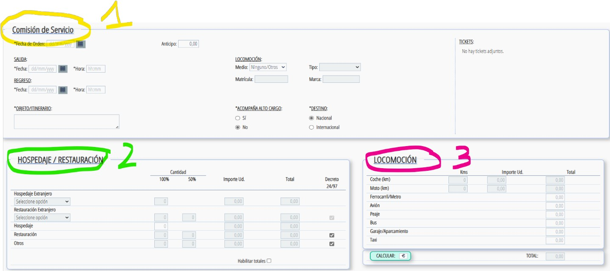
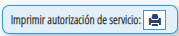
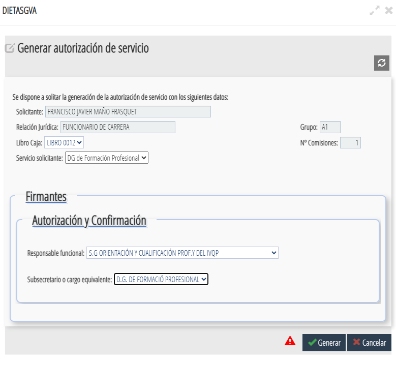
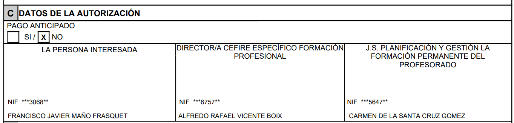
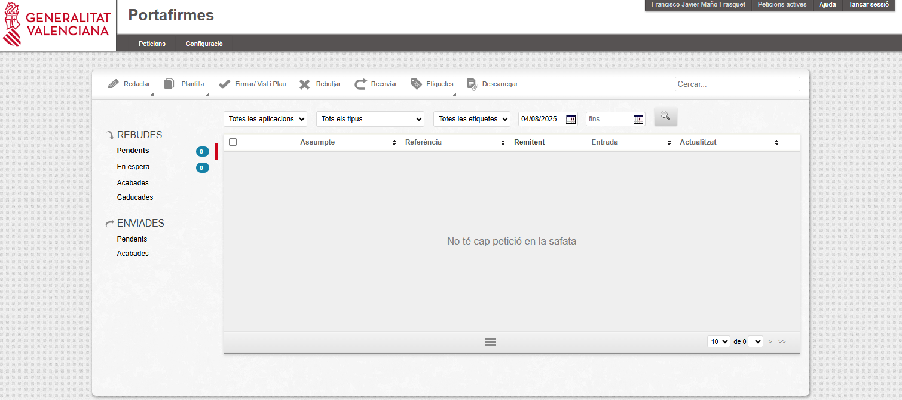
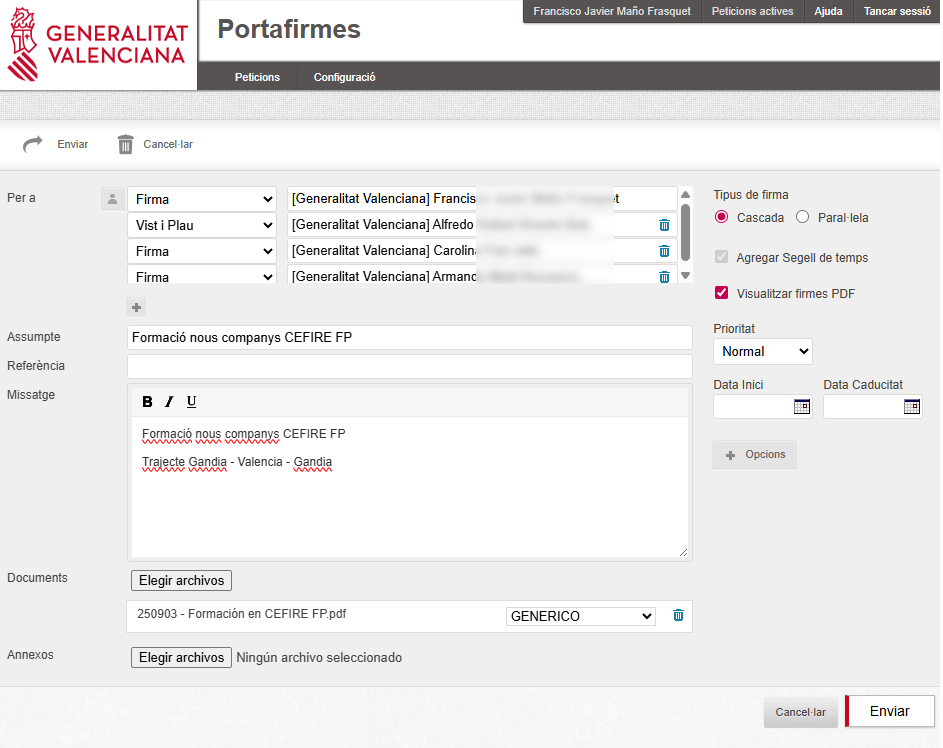
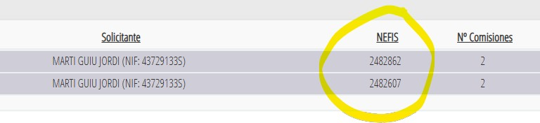

# **Gestió administrativa**

La gestió administrativa és una part fonamental del treball de l’assessor/a, ja que permet organitzar i tramitar correctament totes les activitats i desplaçaments relacionats amb la seva tasca professional. Aquesta secció recull informació sobre **comissions de servei, dietes i despeses de desplaçament**, així com els procediments i documents necessaris.

---

## 📝 Comissions de servei

#### Què són i per a què serveixen

Les **comissions de servei** són autoritzacions temporals que permeten als assessors/es realitzar activitats **fora del seu lloc habitual de treball**, com ara:

* Desplaçaments a centres de FP.
* Assistència a jornades o seminaris.
* Reunions de coordinació amb altres CEFIREs o amb la DGFP.

L’objectiu és garantir que aquests desplaçaments estiguen **formalment autoritzats** i compten amb la cobertura administrativa i econòmica corresponent.

Les comissions es poden autoritzar per diferents vies:

* Escrita
* Oral

La persona que autoritza és la mateixa que confirma.  
  
**Després és obligatori registrar i confirmar la comissió en l’aplicació encara que s’haja comunicat per altres mitjans.**
  
**La confirmació ha de fer-se abans del desplaçament,** imprimint la comissió de servei i pujant-la a porta firmes. Este procediment s'explica més endavant.
  
En el document de la comisió de servei ha de quedar constància:  
    * De la data real de l’autorització  
    * Del mitjà utilitzat (oral, email, etc.)  

📌 Exemple pràctic  
1. Es dona una ordre oral per fer una comissió (ex: 1 de febrer).  
2. Es registra la comissió de servei.  
3. Es confirma la comissió de servei mitjançant el portafirmes.  
4. Es realitza el desplaçament.  
5. Es demama la dieta.  

### ⚙️ Procediment pas a pas per a demanar una comissió de servei

1. **Accedir a l’aplicació [GVADietas]({{ enlaces.gva_dietas }} "GVADietas"){: target="_blank" }**
    - Has d'estar dins de la xarxa de la GVA.
    - T'has de loguejar amb el teu certificat digital.
    {: .center}

2. **Entrar en Indemnizaciones/Comisiones** y polsar buscar per a que aparega el botó de , que polsarem per a crear una nova comissió de servei.  
    {: .center}

3. **Omplirem totes les dades necesaries**

    {: .center}

    <ol type="1">
      <li><strong>En l'apartat de COMISSIÓ DE SERVEI</strong>, hem d'introduir les dates de la comissió, l'objecte d'esta, així com les característiques pròpies, com ara la destinació (nacional o internacional) o si hem utilitzat un mitjà de locomoció propi.
        <ul>
          <li>És important posar en la <strong>DATA D'ORDRE</strong> la data en què es va donar l'ordre d'eixida, <strong>indicant la forma de la comunicació</strong> (oral, escrita, telefònica, etc.), encara que la comissió s'estiga registrant en l'aplicació després de l'eixida.</li>
          <li>En l'apartat <strong>OBJECTE/ITINERARI</strong>, s'ha d'indicar el motiu (objecte) del desplaçament i l'itinerari que es realitzarà. En l'itinerari cal indicar els centres d'origen i de destinació i la localitat. L'origen del desplaçament serà el <strong>CENTRE DE TREBALL</strong>. Exemple: CEFIRE XXXX - CEIP/IES XXX (localitat) - CEFIRE XXXX.</li>
          <li>En l'apartat <strong>LOCOMOCIÓ</strong>, s'ha d'indicar si el mitjà és vehicle propi, vehicle oficial o altres / cap. En cas de desplaçament amb vehicle propi, es genera dieta per quilometratge i s'habilita la casella de <strong>Km</strong> en l'apartat de locomoció. Cal omplir el tipus de vehicle, la matrícula i la marca del vehicle (es guarda automàticament per a pròximes vegades).</li>
        </ul>
      </li>
      <li><strong>HOSTALATGE / RESTAURACIÓ</strong>: es calcula <strong>automàticament</strong> quan polses la pestanya <strong>CALCULAR</strong> , situada baix a la dreta, una vegada introduïdes les dates.</li>
      <li><strong>LOCOMOCIÓ</strong>: en GVA Dietes s'han de posar manualment els quilòmetres. Per a fer-ho, podeu utilitzar Google Maps i <strong>s'optarà sempre per la ruta més curta en quilòmetres</strong>.</li>
    </ol>

    Després de revisar totes les dades, cal guardar la comissió.  
      
    {: .center}

4. **Imprimirem la autorització** polsant el botó  i ens apareixerà una finestra que tindrem que omplir.  
      
    !!!warning "Atenció"
        Cada assesor/a, haurà d'omplir els camps de la comissió de servei segons indique el director del CEFIRE de FP o el Cap de Servei.

5. **Generarem el pdf que guardarem per a la firma** abans de realitzar el desplaçament. Quan generem el pdf haurem de posar a la subdirectora.  

    {: .center}  

    Ens hem d'asegurar que en el pdf aprèixen el director i la subdirectora.  
    
    {: .center}  

      
    !!!tip "Recomanació"
        💡 Es recomana guardar una còpia de la comissió aprovada per a qualsevol comprovació posterior.

6. **Firmarem digitalment el pdf i li'l enviarem per mail a Alfredo**. Cal també enviar-li WhatsApp per a avisar-lo.

7. Alfredo enviarà la comissió a Carolina i a Armando per a que la signen i una vegada signada ens la enviarà, per a que ens la guardem.

<!-- 6. **Ara entrarem en el [Portal de Firmes de GVA]({{enlaces.firmas_gva}} ){: target="_blank"}** on ens loguejarem amb el certificat digital  
    {: .center}

7. **Redactem una nova petició**
    - En missatge hem de detallar clarament el motiu de la comissió de servei
    - En firma, deurem de possar les persones que ens han de signar la comissió. Normalment, la signatura anirà en cascada
    - En documents, pugem el pdf de la comissió que hem generat abans
    - Una vegada estiguen tots els camps plens, l'enviem per a signar

    {: .center}

7. S'obri una nova finestra on seleccionarem el nostre nom y polsarem finalitza

-->

8. **Una vegada ja ens hagam desplaçat** haurem de demanar la dieta --> Seguent apartat

---

## 💰 Dieta i despeses de desplaçament

#### Normativa

Les dietes i despeses de desplaçament es gestionen segons la **normativa vigent de la Generalitat Valenciana**, que estableix:

* Quantitat diària segons tipus de desplaçament.
* Possibilitat de justificar despeses de transport, allotjament i manutenció.
* Procediment de presentació de documents i justificants.

Les despeses que no siguen despeses de transport i manutenció s'han de justificar mitjançant:  

* Factures
* Justificants electrònics

L’administració pot requerir en qualsevol moment:  

* Els documents originals de les despeses

### ⚙️ Procediment pas a pas per a demanar una dieta

Una vegada realitzada la comissió de servei, acceptada i ja ens hem desplaçat i hem tornat. Podem demanar la dieta. 

!!!warning "IMPORTANT"
    Es generaran **TOTES les dietes EN FINALITZAR EL MES**.  
    **Les seleccionarem totes i generarem la dieta.**  
    En **"Generar Dieta"**, esteu confirmant que el desplaçament **SÍ** que s'ha realitzat. Per això, reviseu bé les comissions seleccionades abans de fer este pas, per a evitar generar dietes per desplaçaments no efectuats.

Els passos per a generar-les son:

1. **Accedirem a l’aplicació [GVADietas]({{ enlaces.gva_dietas }} "GVADietas"){: target="_blank" }**
    - Has d'estar dins de la xarxa de la GVA.
    - T'has de loguejar amb el teu certificat digital.
    {: .center}

2. **Entrarem en Indemnizaciones/Comisiones**, **seleccionarem TOTES les dietes del mes**, polsarem **Generar Dieta**.   
    {: .center}

3. **Omplirem les dades** y polsarem "Generar Dieta"  
    
    {: .center}  
      
    !!!warning "Atenció"
        Cada assesor/a, haurà d'omplir els camps de la dieta segons indique el director del CEFIRE de FP o el Cap de Servei.

4. **Confirmarem la dieta**  
    {: .center}

    !!!warning "Atenció"
        Cal repasar que estiga tot correcte abans de confirmar.  
    
5. **Registrarem les dietes en l'Excel mensual**

    Cada assessor/a haurà de registrar les comissions que realitze cada mes en una **Excel mensual de registre de dietes**, que es troba en la següent carpeta:  
    [:material-folder: Carpeta Comissions de Servei]({{enlaces.carpeta_comissions}}){: .md-button target="_blank"}

    Este fitxer permet portar un control global de les dietes i tramitar, des de **Gestió Econòmica**, el pagament de les que corresponguen al mes en què s'han realitzat.

    En l'Excel s'ha d'indicar obligatòriament:

    - Número de **NEFIS**.
    - **DNI** de l'assessor/a.
    - **Nom i cognoms**.
    - **Import** de les dietes.

    El número de **NEFIS** i el **DNI** són necessaris per a localitzar correctament les dietes en NEFIS.

    !!!warning "Obtenció del núm. NEFIS en Dietes GVA"
        Per a obtindre el número **NEFIS** de la dieta, cal seguir estos passos:

        1. Anar a **Pantalla d'inici → Indemnizaciones → Seguimiento de Dietas**.
        2. Indicar la data d'inici i la data de fi, i fer clic en **"Buscar"**.

            Per defecte, si no es modifiquen les dates, la cerca es realitza des dels **9 mesos anteriors**.

        3. En el llistat de dietes generades, un dels camps que apareix és el número **NEFIS**.  

        {: .center}

    !!!warning "IMPORTANT"
        **Només es pagaran les dietes que estiguen incloses en esta Excel resum.**

6. **Si volem saber l'estat de les dietes, hem d'anar a "Menú/Historico de Comisiones"**

---

## ❓Preguntes freqüents

* **Què faig si canvio la data del desplaçament?**  
  Cal modificar la comissió existent a l’aplicació i enviar-la novament per a aprovació.  

* **Puc fer una comissió per més d’un dia?**  
  Sí, sempre indicant les dates exactes i el motiu per cada jornada.  

* **Quins documents he de conservar?**  
  Sempre guardar còpia de la comissió aprovada i dels justificants de despeses.  

---

<!-- DESDE AQUI LO NUEVO 

# **Gestió administrativa**

La gestió administrativa és una part fonamental del treball de l’assessor/a, ja que permet organitzar i tramitar correctament totes les activitats i desplaçaments relacionats amb la seva tasca professional. Aquesta secció recull informació sobre **comissions de servei, dietes i despeses de desplaçament**, així com els procediments i documents necessaris.

---

## 📝 Comissions de servei

#### Què són i per a què serveixen

Les **comissions de servei** són autoritzacions temporals que permeten als assessors/des realitzar activitats **fora del seu lloc habitual de treball**, com ara:

* Desplaçaments a centres de FP.
* Assistència a jornades o seminaris.
* Reunions de coordinació amb altres CEFIREs o amb la DGFP.

L’objectiu és garantir que aquests desplaçaments estiguen **formalment autoritzats** i comptin amb la cobertura administrativa i econòmica corresponent.

Les comissions es poden autoritzar per diferents vies:

* Escrita
* Oral

La persona que autoritza és la mateixa que confirma.  
La confirmació pot fer-se:
* Abans o després del desplaçament

**Després és obligatori registrar i confirmar la comissió en l’aplicació encara que s’haja comunicat per altres mitjans.**

En el document de la comisió de servei ha de quedar constància:
* De la data real de l’autorització
* Del mitjà utilitzat (oral, email, etc.)

📌 Exemple pràctic  
1. Es dona una ordre oral per fer una comissió (ex: 1 de febrer)  
2. Es realitza el desplaçament  
3. Es registra la comissió dies després  
4. Es genera i envia el document per a signar  
5. Es firma posteriorment, però reflectint la data original de l’ordre  

### ⚙️ Procediment pas a pas per a demanar una comissió de servei

1. **Accedir a l’aplicació [GVADietas]({{ enlaces.gva_dietas }} "GVADietas"){: target="_blank" }**
    - Has d'estar dins de la xarxa de la GVA.
    - T'has de loguejar amb el teu certificat digital.
    {: .center}

2. **Entrar en Indemnizaciones/Comisiones** y polsar buscar per a que aparega el botó de , que polsarem per a crear una nova comissió de servei.  
    {: .center}

3. **Omplirem totes les dades necesaries**
    - És important indicar amb claretat el objecte de la comissió i el itinerari.
    - S'ha indicar si l'autorització es oral o escrita.
    - Una vegada introduides totes les dades (dates, vehicle, kilometres, etc..), polsarem 
    - I després guardar.  
      
    {: .center}

4. **Una vegada ja ens hagam desplaçat** haurem de demanar la dieta -> Seguent apartat

---

## 💰 Dieta i despeses de desplaçament

#### Normativa

Les dietes i despeses de desplaçament es gestionen segons la **normativa vigent de la Generalitat Valenciana**, que estableix:

* Quantitat diària segons tipus de desplaçament.
* Possibilitat de justificar despeses de transport, allotjament i manutenció.
* Procediment de presentació de documents i justificants.

Les despeses que no siguen despeses de transport i manutenció s'han de justificar mitjançant:  

* Factures
* Justificants electrònics

L’administració pot requerir en qualsevol moment:  

* Els documents originals de les despeses

### ⚙️ Procediment pas a pas per a demanar una dieta

Una vegada realitzada la comissió de servei, acceptada i ja ens hem desplaçat i hem tornat. Podem demanar la dieta. Els passos per a demanar-la son:

1. **Accedir a l’aplicació [GVADietas]({{ enlaces.gva_dietas }} "GVADietas"){: target="_blank" }**
    - Has d'estar dins de la xarxa de la GVA.
    - T'has de loguejar amb el teu certificat digital.
    {: .center}

2. **Entrar en Indemnizaciones/Comisiones** y polsar buscar per a que aparega la comissió de la qual volem demanar la dieta. Seleccionar la dieta y polsar   
    {: .center}

3. **Omplirem les dades** y polsarem "Generar"  
   {: .center}  
      
    !!!warning "Atenció"
        Cada assesor/a, haurà d'omplir els camps de la dieta segons indique el director del CEFIRE de FP o el Cap de Servei.

4. **Confirmarem la dieta**  
   {: .center}

    !!!warning "Atenció"
        Cal repasar que estiga tot correcte abans de confirmar.  
    
5.- **Si volem saber el estat de les dietes, hem d'anar a "Menú/Historico de Comisiones"**

---

## ❓Preguntes freqüents

* **Què faig si canvio la data del desplaçament?**  
  Cal modificar la comissió existent a l’aplicació i enviar-la novament per a aprovació.  

* **Puc fer una comissió per més d’un dia?**  
  Sí, sempre indicant les dates exactes i el motiu per cada jornada.  

* **Quins documents he de conservar?**  
  Sempre guardar còpia de la comissió aprovada i dels justificants de despeses.  

---

 -->

