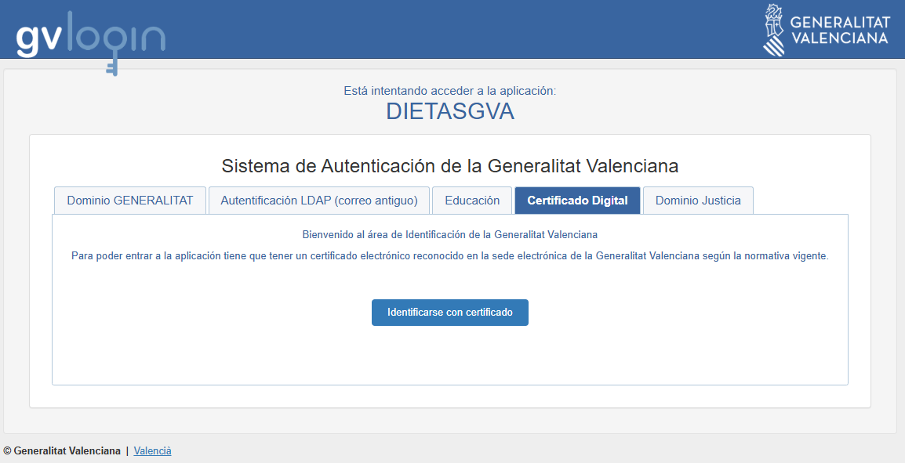
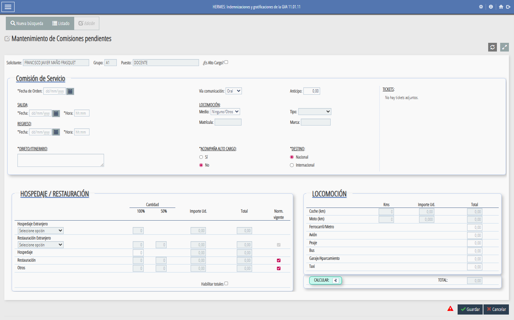
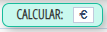
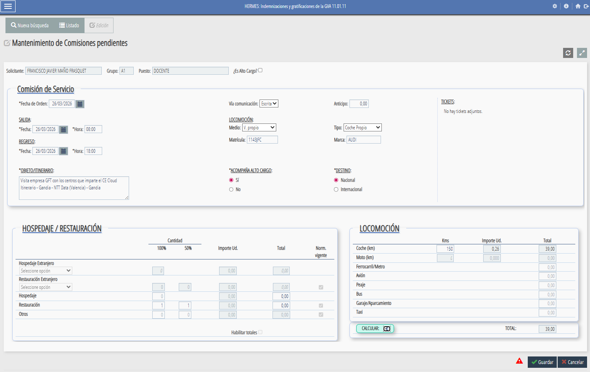
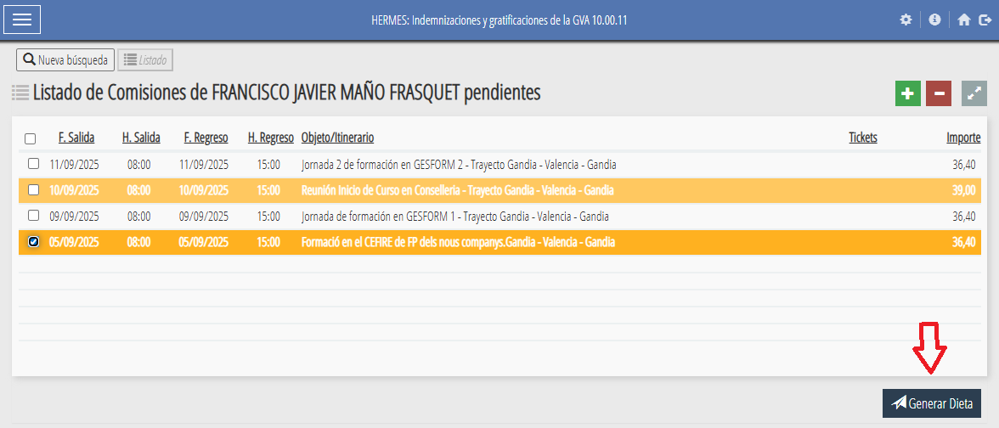
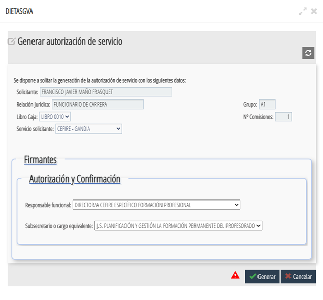
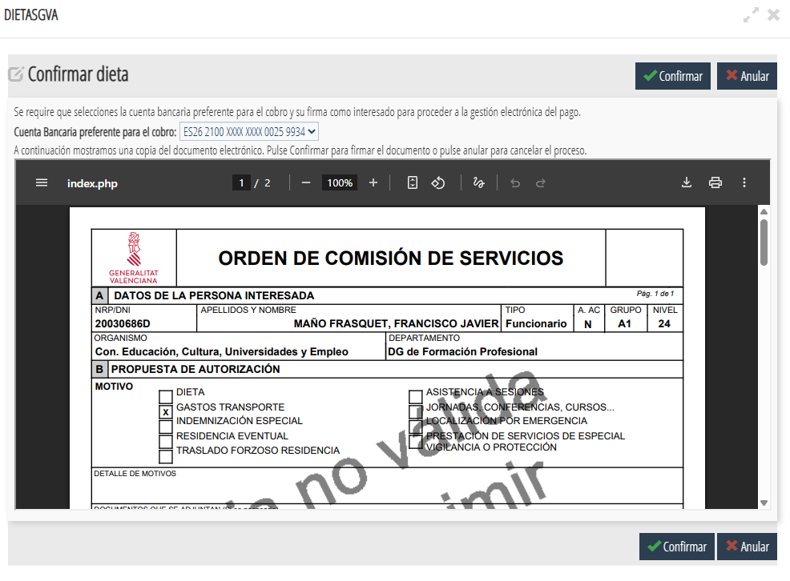

# **Gestió administrativa**

La gestió administrativa és una part fonamental del treball de l’assessor/a, ja que permet organitzar i tramitar correctament totes les activitats i desplaçaments relacionats amb la seva tasca professional. Aquesta secció recull informació sobre **comissions de servei, dietes i despeses de desplaçament**, així com els procediments i documents necessaris.

---

## 📝 Comissions de servei

#### Què són i per a què serveixen

Les **comissions de servei** són autoritzacions temporals que permeten als assessors/des realitzar activitats **fora del seu lloc habitual de treball**, com ara:

* Desplaçaments a centres de FP.
* Assistència a jornades o seminaris.
* Reunions de coordinació amb altres CEFIREs o amb la DGFP.

L’objectiu és garantir que aquests desplaçaments estiguen **formalment autoritzats** i comptin amb la cobertura administrativa i econòmica corresponent.

Les comissions es poden autoritzar per diferents vies:

* Escrita
* Oral

La persona que autoritza és la mateixa que confirma.  
La confirmació pot fer-se:
* Abans o després del desplaçament

**Després és obligatori registrar i confirmar la comissió en l’aplicació encara que s’haja comunicat per altres mitjans.**

En el document de la comisió de servei ha de quedar constància:
* De la data real de l’autorització
* Del mitjà utilitzat (oral, email, etc.)

📌 Exemple pràctic  
1. Es dona una ordre oral per fer una comissió (ex: 1 de febrer)  
2. Es realitza el desplaçament  
3. Es registra la comissió dies després  
4. Es genera i envia el document per a signar  
5. Es firma posteriorment, però reflectint la data original de l’ordre  

### ⚙️ Procediment pas a pas per a demanar una comissió de servei

1. **Accedir a l’aplicació [GVADietas]({{ enlaces.gva_dietas }} "GVADietas"){: target="_blank" }**
    - Has d'estar dins de la xarxa de la GVA.
    - T'has de loguejar amb el teu certificat digital.
    {: .center}

2. **Entrar en Indemnizaciones/Comisiones** y polsar buscar per a que aparega el botó de , que polsarem per a crear una nova comissió de servei.  
    {: .center}

3. **Omplirem totes les dades necesaries**
    - És important indicar amb claretat el objecte de la comissió i el itinerari.
    - S'ha indicar si l'autorització es oral o escrita.
    - Una vegada introduides totes les dades (dates, vehicle, kilometres, etc..), polsarem 
    - I després guardar.  
      
    {: .center}

4. **Una vegada ja ens hagam desplaçat** haurem de demanar la dieta --> Seguent apartat

---

## 💰 Dieta i despeses de desplaçament

#### Normativa

Les dietes i despeses de desplaçament es gestionen segons la **normativa vigent de la Generalitat Valenciana**, que estableix:

* Quantitat diària segons tipus de desplaçament.
* Possibilitat de justificar despeses de transport, allotjament i manutenció.
* Procediment de presentació de documents i justificants.

Les despeses que no siguen despeses de transport i manutenció s'han de justificar mitjançant:  

* Factures
* Justificants electrònics

L’administració pot requerir en qualsevol moment:  

* Els documents originals de les despeses

### ⚙️ Procediment pas a pas per a demanar una dieta

Una vegada realitzada la comissió de servei, acceptada i ja ens hem desplaçat i hem tornat. Podem demanar la dieta. Els passos per a demanar-la son:

1. **Accedir a l’aplicació [GVADietas]({{ enlaces.gva_dietas }} "GVADietas"){: target="_blank" }**
    - Has d'estar dins de la xarxa de la GVA.
    - T'has de loguejar amb el teu certificat digital.
    {: .center}

2. **Entrar en Indemnizaciones/Comisiones** y polsar buscar per a que aparega la comissió de la qual volem demanar la dieta. Seleccionar la dieta y polsar   
    {: .center}

3. **Omplirem les dades** y polsarem "Generar"  
   {: .center}  
      
    !!!warning "Atenció"
        Cada assesor/a, haurà d'omplir els camps de la dieta segons indique el director del CEFIRE de FP o el Cap de Servei.

4. **Confirmarem la dieta**  
   {: .center}

    !!!warning "Atenció"
        Cal repasar que estiga tot correcte abans de confirmar.  
    
5.- **Si volem saber el estat de les dietes, hem d'anar a "Menú/Historico de Comisiones"**

---

## ❓Preguntes freqüents

* **Què faig si canvio la data del desplaçament?**  
  Cal modificar la comissió existent a l’aplicació i enviar-la novament per a aprovació.  

* **Puc fer una comissió per més d’un dia?**  
  Sí, sempre indicant les dates exactes i el motiu per cada jornada.  

* **Quins documents he de conservar?**  
  Sempre guardar còpia de la comissió aprovada i dels justificants de despeses.  

---

