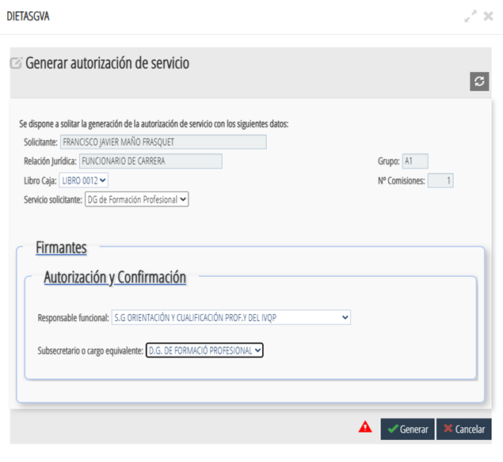
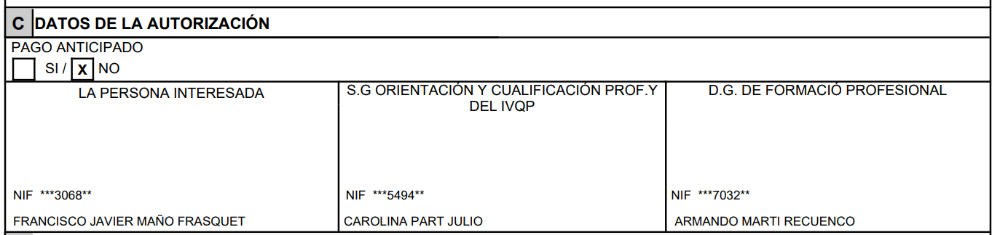
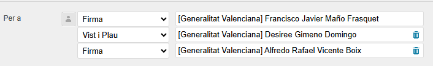
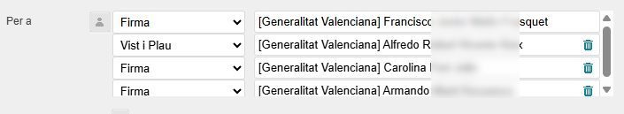

# **Gestió administrativa**

La gestió administrativa és una part fonamental del treball de l’assessor/a, ja que permet organitzar i tramitar correctament totes les activitats i desplaçaments relacionats amb la seva tasca professional. Aquesta secció recull informació sobre **comissions de servei, dietes i despeses de desplaçament**, així com els procediments i documents necessaris.

---

## 📝 Comissions de servei

#### Què són i per a què serveixen

Les **comissions de servei** són autoritzacions temporals que permeten als assessors/es realitzar activitats **fora del seu lloc habitual de treball**, com ara:

* Desplaçaments a centres de FP.
* Assistència a jornades o seminaris.
* Reunions de coordinació amb altres CEFIREs o amb la DGFP.

L’objectiu és garantir que aquests desplaçaments estiguen **formalment autoritzats** i compten amb la cobertura administrativa i econòmica corresponent.

Les comissions es poden autoritzar per diferents vies:

* Escrita
* Oral

La persona que autoritza és la mateixa que confirma.  
  
**Després és obligatori registrar i confirmar la comissió en l’aplicació encara que s’haja comunicat per altres mitjans.**
  
**La confirmació ha de fer-se abans del desplaçament,** imprimint la comissió de servei i pujant-la a porta firmes. Este procediment s'explica més endavant.
  
En el document de la comissió de servei ha de quedar constància:  
    * De la data real de l’autorització  
    * Del mitjà utilitzat (oral, email, etc.)  

!!!example "📌 Exemple pràctic"
    1. Es dona una ordre oral per fer una comissió.
    2. Es registra la comissió.
    3. Es confirma mitjançant Portafirmes.
    4. Es realitza el desplaçament.
    5. Es genera la dieta.

### 🚗 Protocol de mobilitat i desplaçaments

La Subdirecció General de Formació Professional ha establit una sèrie de criteris per a la gestió dels desplaçaments dels assessors i assessores de la Xarxa CEFIRE i de la SDGFP. L'objectiu és optimitzar els recursos públics i garantir una gestió homogènia de les comissions de servei.

#### 🏙️ Desplaçaments dins del mateix municipi

Quan una activitat es realitze dins de la mateixa localitat o terme municipal on es troba el centre de treball:

* Els desplaçaments han d'estar **expressament autoritzats** per la direcció del CEFIRE o per la Cap de Servei.
* Preferentment s'utilitzarà el **transport públic**.
* L'ús de vehicle propi només generarà dret a indemnització si existeix una autorització expressa.

!!!warning "Important"
    En cap cas es generaran despeses de restauració per desplaçaments realitzats dins del mateix terme municipal, encara que l'aplicació les calcule automàticament. En estos casos cal desmarcar els imports indicats en «Normativa vigent» i tornar a calcular.

***Quan no s'autoritza el pagament del desplaçament***

**Si la direcció del CEFIRE no autoritza el pagament del desplaçament** dins del mateix municipi, caldrà:

1. Registrar la comissió de servei amb normalitat.
2. Introduir les dades de data, itinerari, horari i objecte.
3. Seleccionar **"Ninguno/Otros"** en locomoció.
4. Introduir **0,01 €** en el concepte «Metro/Ferrocarril».
5. Polsar **Calcular** i **Guardar**.
6. Generar l'autorització.
7. Una vegada descarregada, eliminar la dieta per a evitar que es tramite per error posteriorment.

#### 🌍 Desplaçaments fora del municipi

Quan diversos assessors o assessores hagen d'assistir al mateix lloc i en el mateix horari:

* És obligatori agrupar el personal en un únic vehicle o en el menor nombre possible de vehicles.
* No s'autoritzaran desplaçaments individuals si hi ha places disponibles en un vehicle que realitze el mateix trajecte.

🚗 Vehicle i quilometratge

* En la comissió de servei s'identificarà la persona que aporta el vehicle.
* Només esta persona registrarà el quilometratge en GVADietas.
* Els quilòmetres s'introduiran manualment.
* Sempre s'utilitzarà la ruta més curta calculada per Google Maps.

!!!info "Coordinació prèvia"
    Abans de registrar qualsevol comissió de servei, els assessors i assessores hauran de coordinar-se per a organitzar els desplaçaments compartits.

📚 Jornades i activitats formatives

Quan la comissió de servei estiga relacionada amb una jornada, curs o activitat formativa presencial, en l'apartat **Objecte de la comissió** s'haurà d'indicar, si escau, el corresponent **codi de l'activitat en GESFORM**.

!!!warning "Validació de les dietes"
    Les dietes que no complisquen els criteris de mobilitat, agrupació de vehicles o registre establits en este protocol podran ser rebutjades.

### ⚙️ Procediment pas a pas per a demanar una comissió de servei

1. **Accedir a l’aplicació [GVADietas]({{ enlaces.gva_dietas }} "GVADietas"){: target="_blank" }**
    - Has d'estar dins de la xarxa de la GVA.
    - T'has de loguejar amb el teu certificat digital.
    {: .center}

2. **Entrar en Indemnizaciones/Comisiones** i polsar buscar  per a que aparega el botó de , que polsarem per a crear una nova comissió de servei.  
    {: .center}

3. **Omplirem totes les dades necessàries**

    {: .center}

    <ol type="1">
      <li><strong>En l'apartat de COMISSIÓ DE SERVEI</strong>, hem d'introduir les dates de la comissió, l'objecte d'esta, així com les característiques pròpies, com ara la destinació (nacional o internacional) o si hem utilitzat un mitjà de locomoció propi.
        <ul>
            <li>És important posar en la <strong>DATA D'ORDRE</strong> la data en què es va donar l'ordre d'eixida, <strong>indicant la forma de la comunicació</strong> (oral, escrita, telefònica, etc.), encara que la comissió s'estiga registrant en l'aplicació després de l'eixida.</li>
            <li>En l'apartat <strong>OBJECTE/ITINERARI</strong>, s'ha d'indicar el motiu (objecte) del desplaçament i l'itinerari que es realitzarà.
            <ul>
                <li> En <strong>objecte</strong> s'ha d'indicar l'objecte del desplaçament.
                <ul>
                    <li>Si el desplaçament és per assistir a l'obertura/clausura d'una formació o per assistir a una jornada, s'haurà d'indicar **codi de l'activitat i el nom de l'activitat**.</li>
                    <li>Si el desplaçament és per a algun projecte de la DGFP, s'haurà d'indicar el **codi del projecte**</li>
                </ul>
                <li> En l'**itinerari** cal indicar els centres d'origen i de destinació i la localitat. L'origen del desplaçament serà el <strong>CENTRE DE TREBALL</strong>. Exemple: CEFIRE XXXX - CEIP/IES XXX (localitat) - CEFIRE XXXX. </li>
            </ul>
            </li>
            <li>En l'apartat <strong>LOCOMOCIÓ</strong>, s'ha d'indicar si el mitjà és vehicle propi, vehicle oficial o altres / cap. En cas de desplaçament amb vehicle propi, es genera dieta per quilometratge i s'habilita la casella de <strong>Km</strong> en l'apartat de locomoció. Cal omplir el tipus de vehicle, la matrícula i la marca del vehicle (es guarda automàticament per a pròximes vegades).</li>
        </ul>
      </li>
      <li><strong>HOSTALATGE / RESTAURACIÓ</strong>: es calcula <strong>automàticament</strong> quan polses el botó , situat baix a la dreta, una vegada introduïdes les dates.</li>
      <li><strong>LOCOMOCIÓ</strong>: en GVA Dietes s'han de posar manualment els quilòmetres. Per a fer-ho, podeu utilitzar Google Maps i <strong>s'optarà sempre per la ruta més curta en quilòmetres</strong>.</li>
    </ol>

    Després de revisar totes les dades, cal guardar la comissió.  
      
    {: .center}  

4. Després cal tornar a entrar en la comissió perquè aparega el botó  i poder **imprimir l'autorització**. Una vegada polsem el botó, ens apareixerà una finestra que haurem d'omplir. Caldrà tindre en compte dos possibles casos:

    1. **Comissions relacionades amb el CEFIRE**

        - Servicio solicitante: CEFIRE
        - Libro caja: LIBRO 0010
        - Responsable funcional: DIRECTOR/A CEFIRE ESPECÍFICO FORMACIÓN PROFESIONAL
        - Subsecretario o cargo equivalente: J.S. PLANIFICACIÓN Y GESTIÓN DE LA FORMACIÓN PERMANENTE DEL PROFESORADO

        {: .center}

    2. **Comissions relacionades amb projectes de la DGFP**

        - Servicio solicitante: D.G. de Formación Profesional
        - Libro caja: LIBRO 0012
        - Responsable funcional: S.G. ORIENTACIÓN Y CUALIFICACIÓN PROF. Y DEL IVQP
        - Subsecretario o cargo equivalente: D.G. DE FORMACIÓ PROFESSIONAL

        {: .center}

5. **Generarem el pdf que guardarem per a la firma** abans de realitzar el desplaçament. Quan generem el pdf haurem de posar a la subdirectora.    

    Ens hem d'asegurar que en el pdf  

    
    1. **Comissions relacionades amb el CEFIRE** --> apareixen director Alfredo Rafael Vicente i la cap de servei Carmen de la Santa

        {: .center}

    2. **Comissions relacionades amb projectes de la DGFP** --> apareixen la subdirectora Carolina Part i el director Armando

        {: .center}
    

6. **Ara entrarem en el [Portal de Firmes de GVA]({{enlaces.firmas_gva}} ){: target="_blank"}** on ens loguejarem amb el certificat digital  
    {: .center}

7. **Redactem una nova petició**
    - En missatge hem de detallar clarament el motiu de la comissió de servei
    - En documents, pugem el pdf de la comissió que hem generat abans
    - En firma, tindrem dos casos:
        - **Comissions relacionades amb el CEFIRE**.- En este cas les firmes han de ser: {: .center}
        - **Comissions relacionades amb projectes de la DGFP**.- En este cas les firmes han de ser: {: .center}
    - Una vegada estiguen tots els camps plens, l'enviem per a signar
    - Example

    {: .center}

8. S'obri una nova finestra on seleccionarem el nostre nom i polsarem finalitza
   
9.  Cada assessor/a haurà de registrar **les comissions relacionades amb el CEFIRE** que realitze cada mes en una **Excel mensual de registre de dietes**, que es troba en la següent carpeta:  
    [:material-folder: Carpeta Comissions de Servei]({{enlaces.carpeta_comissions}}){: .md-button target="_blank"}

    La nomenclatura del fitxer Excel es 26xx_Dietas_CEFIRE_FP, on xx és el número de mes de les dietes. Per example, per les dietes de juny l'arxiu s'anomenarà 2606_Dietas_CEFIRE_FP.xlsx.  

    En eixa Excel es registrarà cadascuna de les comissions i permet portar un control global de les dietes i tramitar, des de **Gestió Econòmica**, el pagament de les que corresponguen al mes en què s'han realitzat.

    En l'Excel s'ha d'indicar obligatòriament:

    - Número de **NEFIS**. (L'obtindrem a final de mes quan demanem la dieta de TOTES les comissions juntes)
    - **DNI** de l'assessor/a.
    - **Nom i cognoms**.
    - **Import** de les dietes.
    - **Data de la comissió**

   
10. **Una vegada ja ens hagam desplaçat** i A FINAL DE MES haurem de demanar que ens paguen TOTES les dietes d'eixe mes --> Seguent apartat

!!!tip "Recomanació"
    💡 Es recomana guardar una còpia de la comissió aprovada per a qualsevol comprovació posterior.

---

## 💰 Dieta i despeses de desplaçament

#### Normativa

Les dietes i despeses de desplaçament es gestionen segons la **normativa vigent de la Generalitat Valenciana**, que estableix:

* Quantitat diària segons tipus de desplaçament.
* Possibilitat de justificar despeses de transport, allotjament i manutenció.
* Procediment de presentació de documents i justificants.

Les despeses que no siguen despeses de transport i manutenció s'han de justificar mitjançant:  

* Factures
* Justificants electrònics

L’administració pot requerir en qualsevol moment:  

* Els documents originals de les despeses

### ⚙️ Procediment pas a pas per a demanar una dieta

Una vegada realitzada la comissió de servei, acceptada i ja ens hem desplaçat i hem tornat. Podem demanar la dieta. 

⚠️ **IMPORTANT**

- Es generaran **TOTES les dietes EN FINALITZAR EL MES**.
- **Les seleccionarem totes i generarem la dieta.**
- En **"Generar Dieta"**, esteu confirmant que el desplaçament **SÍ** que s'ha realitzat. Per això, reviseu bé les comissions seleccionades abans de fer este pas, per a evitar generar dietes per desplaçaments no efectuats.

Els passos per a generar-les son:

1. **Accedirem a l’aplicació [GVADietas]({{ enlaces.gva_dietas }} "GVADietas"){: target="_blank" }**
    - Has d'estar dins de la xarxa de la GVA.
    - T'has de loguejar amb el teu certificat digital.
    {: .center}

2. **Entrarem en Indemnizaciones/Comisiones**, **seleccionarem TOTES les dietes del mes**, polsarem **Generar Dieta**.   
    {: .center}

3. **Omplirem les dades** i polsarem "Generar Dieta". Hi ha dos casos:  
    - **Comissions relacionades amb el CEFIRE**.- En este cas hem d'omplir les següents dades: {: .center}
    - **Comissions relacionades amb projectes de la DGFP**.- En este cas hem d'omplir les següents dades: {: .center}  
    
4. **Confirmarem la dieta**  
    {: .center}

    !!!warning "Atenció"
        Cal repassar que estiga tot correcte abans de confirmar.  
    
5. **Posarem el número de NEFIS en el registre de comissions en l'Excel mensual**

    Cada assessor/a haurà de registrar les comissions que realitze cada mes en una **Excel mensual de registre de dietes**, que es troba en la següent carpeta:  
    [:material-folder: Carpeta Comissions de Servei]({{enlaces.carpeta_comissions}}){: .md-button target="_blank"}

    La nomenclatura del fitxer Excel es 26xx_Dietas_CEFIRE_FP, on xx és el número de mes de les dietes. Per example, per les dietes de juny l'arxiu s'anomenarà 2606_Dietas_CEFIRE_FP.xlsx.  
    
    Este fitxer permet portar un control global de les dietes i tramitar, des de **Gestió Econòmica**, el pagament de les que corresponguen al mes en què s'han realitzat.

    En l'Excel s'ha d'indicar obligatòriament:

    - Número de **NEFIS**.
    - **DNI** de l'assessor/a.
    - **Nom i cognoms**.
    - **Import** de les dietes.
    - **Data de la comissió**

    El número de **NEFIS** i el **DNI** són necessaris per a localitzar correctament les dietes en NEFIS.

    !!!warning "Obtenció del núm. NEFIS en Dietes GVA"
        Per a obtindre el número **NEFIS** de la dieta, cal seguir estos passos:

        1. Anar a **Pantalla d'inici → Indemnizaciones → Seguimiento de Dietas**.
        2. Indicar la data d'inici i la data de fi, i fer clic en **"Buscar"**.

            Per defecte, si no es modifiquen les dates, la cerca es realitza des dels **9 mesos anteriors**.

        3. En el llistat de dietes generades, un dels camps que apareix és el número **NEFIS**.  

        {: .center}

    !!!warning "IMPORTANT"
        **Només es pagaran les dietes que estiguen incloses en esta Excel resum.**

6. **Si volem saber l'estat de les dietes, hem d'anar a "Menú/Historico de Comisiones"**

---

## ❓Preguntes freqüents

* **Què faig si canvio la data del desplaçament?**  
  Cal modificar la comissió existent a l’aplicació i enviar-la novament per a aprovació.  

* **Puc fer una comissió per més d’un dia?**  
  Sí, sempre indicant les dates exactes i el motiu per cada jornada.  

* **Quins documents he de conservar?**  
  Sempre guardar còpia de la comissió aprovada i dels justificants de despeses.  

---

<!-- DESDE AQUI LO NUEVO 

# **Gestió administrativa**

La gestió administrativa és una part fonamental del treball de l’assessor/a, ja que permet organitzar i tramitar correctament totes les activitats i desplaçaments relacionats amb la seva tasca professional. Aquesta secció recull informació sobre **comissions de servei, dietes i despeses de desplaçament**, així com els procediments i documents necessaris.

---

## 📝 Comissions de servei

#### Què són i per a què serveixen

Les **comissions de servei** són autoritzacions temporals que permeten als assessors/des realitzar activitats **fora del seu lloc habitual de treball**, com ara:

* Desplaçaments a centres de FP.
* Assistència a jornades o seminaris.
* Reunions de coordinació amb altres CEFIREs o amb la DGFP.

L’objectiu és garantir que aquests desplaçaments estiguen **formalment autoritzats** i comptin amb la cobertura administrativa i econòmica corresponent.

Les comissions es poden autoritzar per diferents vies:

* Escrita
* Oral

La persona que autoritza és la mateixa que confirma.  
La confirmació pot fer-se:
* Abans o després del desplaçament

**Després és obligatori registrar i confirmar la comissió en l’aplicació encara que s’haja comunicat per altres mitjans.**

En el document de la comissió de servei ha de quedar constància:
* De la data real de l’autorització
* Del mitjà utilitzat (oral, email, etc.)

📌 Exemple pràctic  
1. Es dona una ordre oral per fer una comissió (ex: 1 de febrer)  
2. Es realitza el desplaçament  
3. Es registra la comissió dies després  
4. Es genera i envia el document per a signar  
5. Es firma posteriorment, però reflectint la data original de l’ordre  

### ⚙️ Procediment pas a pas per a demanar una comissió de servei

1. **Accedir a l’aplicació [GVADietas]({{ enlaces.gva_dietas }} "GVADietas"){: target="_blank" }**
    - Has d'estar dins de la xarxa de la GVA.
    - T'has de loguejar amb el teu certificat digital.
    {: .center}

2. **Entrar en Indemnizaciones/Comisiones** i polsar buscar per a que aparega el botó de , que polsarem per a crear una nova comissió de servei.  
    {: .center}

3. **Omplirem totes les dades necessàries**
    - És important indicar amb claretat el objecte de la comissió i el itinerari.
    - S'ha indicar si l'autorització es oral o escrita.
    - Una vegada introduides totes les dades (dates, vehicle, kilometres, etc..), polsarem 
    - I després guardar.  
      
    {: .center}

4. **Una vegada ja ens hagam desplaçat** haurem de demanar la dieta -> Seguent apartat

---

## 💰 Dieta i despeses de desplaçament

#### Normativa

Les dietes i despeses de desplaçament es gestionen segons la **normativa vigent de la Generalitat Valenciana**, que estableix:

* Quantitat diària segons tipus de desplaçament.
* Possibilitat de justificar despeses de transport, allotjament i manutenció.
* Procediment de presentació de documents i justificants.

Les despeses que no siguen despeses de transport i manutenció s'han de justificar mitjançant:  

* Factures
* Justificants electrònics

L’administració pot requerir en qualsevol moment:  

* Els documents originals de les despeses

### ⚙️ Procediment pas a pas per a demanar una dieta

Una vegada realitzada la comissió de servei, acceptada i ja ens hem desplaçat i hem tornat. Podem demanar la dieta. Els passos per a demanar-la son:

1. **Accedir a l’aplicació [GVADietas]({{ enlaces.gva_dietas }} "GVADietas"){: target="_blank" }**
    - Has d'estar dins de la xarxa de la GVA.
    - T'has de loguejar amb el teu certificat digital.
    {: .center}

2. **Entrar en Indemnizaciones/Comisiones** i polsar buscar per a que aparega la comissió de la qual volem demanar la dieta. Seleccionar la dieta i polsar   
    {: .center}

3. **Omplirem les dades** i polsarem "Generar"  
   {: .center}  
      
    !!!warning "Atenció"
        Cada assessor/a, haurà d'omplir els camps de la dieta segons indique el director del CEFIRE de FP o el Cap de Servei.

4. **Confirmarem la dieta**  
   {: .center}

    !!!warning "Atenció"
        Cal repassar que estiga tot correcte abans de confirmar.  
    
5.- **Si volem saber el estat de les dietes, hem d'anar a "Menú/Historico de Comisiones"**

---

## ❓Preguntes freqüents

* **Què faig si canvio la data del desplaçament?**  
  Cal modificar la comissió existent a l’aplicació i enviar-la novament per a aprovació.  

* **Puc fer una comissió per més d’un dia?**  
  Sí, sempre indicant les dates exactes i el motiu per cada jornada.  

* **Quins documents he de conservar?**  
  Sempre guardar còpia de la comissió aprovada i dels justificants de despeses.  

---

 -->
