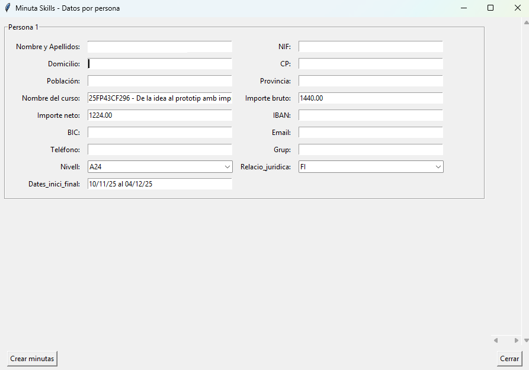

Una vegada finalitzada l’acció formativa i recollides totes les dades de seguiment, cal dur a terme el **procés de tancament i certificació**. Aquest pas és imprescindible per deixar la formació completament justificada davant del CEFIRE, la DGFP i els organismes finançadors (FSE / SKILLS).

---

## 🗂️ 1. Reunir i arxivar totes les evidències 📸

S’han de recopilar les **evidències** de la formació (obligatori en FSE i SKILLS).

#### 🔹 Què inclou?

* Fotos del curs (presencials o captures online).
* Captures de pantalla de sessions en línia.
* Fulles de signatures.
* Publicacions en fòrums d’AULES.
* Materials utilitzats en les sessions.

#### 📁 On guardar-les?

1. A la subcarpeta del curs: **25FPXXCF0XX_tec**
2. I en el document: **25FPXXCF0XX_Evidencias.docx**

---
## 📄 2. Recollida d’APTES i NO APTES

El primer pas és obtindre la documentació que acredita el resultat de cada participant. Per tant ens fa falta un document per part del ponent amb els APTES i NO APTES.

- Si és **formació online**, normalment, les qualificacions es poden extraure d’**AULES**.
- Si és **jornada presencial**, cal recollir la **fulla de signatures**.

Tot aquest material s’ha de guardar dins de la carpeta: **25FPXXCF0XX_tec**

#### ⚠️ Requisits per a l’emissió d’APTE

Un participant només pot obtindre la qualificació **APTE** si compleix tots els criteris següents:

* ✔️ Assistència mínima del **85%** de les sessions.  
* ✔️ Participació activa en les activitats del curs.  
* ✔️ Compliment dels objectius formatius establerts.

Els participants que no compleixen algun d’aquests requisits obtindran la qualificació **NO APTE**.

---

## 📝 3. Introducció d’APTÉS i NO APTÉS en Gesform

Amb tota la documentació recollida:

1. Accedeix a **Gesform**.
2. Selecciona la formació corresponent.
3. Introdueix els **APTÉS i NO APTÉS** segons la informació qu ens haja donat el ponent.
4. Revisa que cap participant quede sense qualificació assignada.

En el següent enllaç pots core com es fa en el tutorial de gesform --> [Posar qualificacions en Gesform]( ../tutorials/tutorial_gesform.md/#posar-les-qualificacions-als-assistents ){:target="_blank"}. 

---

## 🖋️ 4. Generar i signar l’acta final

Des de Gesform:

1. Genera **l’ACTA FINAL oficial** des de GESFORM.
2. Signa-la digitalment.
3. Guarda-la en la carpeta del curs amb el nom: **25FPXXCF0XX_ACTA FINAL.pdf**

En el següent enllaç pots core com es fa en el tutorial de gesform --> [Traure l'acta final]( ../tutorials/tutorial_gesform.md/#traure-lacta-final ){:target="_blank"}. 

---

## 📚 5. Omplir documents administratius finals

Els següents documents són obligatoris en el tancament de qualsevol formació:

* **[codi_curs]_CuadroTexto.docx**
* **[codi_curs]_FSE_Ficha_seguimiento.docx** (en cursos FSE o SKILLS)

Una vegada omplits, s’han de guardar en la carpeta del curs.

---

## 🧾 6. Obtindre el CERTIFICA (aplicació)

Una vegada tancada tota la documentació administrativa prèvia, cal generar el document **CERTIFICA** utilitzant l’aplicació **crea_designa**.

[Aplicació per a crear carpetes de formacions]( {{enlaces.crea_carpeta}}){: .md-button target="_blank"}

!!!note "Nota"
    En el cas de l'apliació de Linux cal donar permisos per a executar l'aplicació en Linux.  
    `chmod +x crea_cursos_linux`  

Guarda’l a la carpeta de "Certifica per a signar".  
[:material-folder: Carpeta certifica per a signar]( {{enlaces.certifica_per_a_signar}} ){: .md-button target="_blank"}

---

## 📝 7. Crear la MINUTA (amb l’aplicació)

La **Minuta** s'ha de realitzar quan es compleixen les següent condicions:

* La formació es d'Skills o d'Erasmus.
* El ponent NO és una empresa o un treblladaro autònom, i per tant, no hi ha factura. Es a dir, el ponent es funcionari de carrera o funcionari interí. 

Per tant, si no està en aquest cas, pasa al punt següent [Generar el **RESOLC** o l’**INFORME DE CONFORMITAT.**](#resolc-conformitat)

!!!note "Nota"
    Quan la formació es d'FSE i el ponent NO és una empresa. La minuta la fa Elena, nosaltres no em de fer res.

La minuta s’ha de generar també mitjançant l’aplicació.  

Quan la generem, per defecte l'aplicació omplirà alguns del camps, el altres hem d'omplir-los nosaltres. 

{: .center }

Alcaració d'alguns dels camps:

* **IBAN**: Número de compte bancari amb el que el ponent s'ha donat d'alta en el PROPER. Si no el sabem podem buscarlo en la fitxa de Dades del Ponent o en el Justificant d'alta en el PROPER.
* **BIC**: Codi alfanumèric associat al compte bancari. Si no el sabem podem buscarlo en la fitxa de Dades del Ponent o en el Justificant d'alta en el PROPER.  
* **Grup**: Indicar el grup de funcionari al que pertany el ponent (A,B,..), *si no es funcionari Posar un guionet*.
* **Nivell**: En nivell cal indicar si es professor o catedràtic.
    * Professor --> Posar A24
    * Catedràtic --> Posar A26
    * Si no es docent --> Posar No aplica
* **Relació Jurídica**: Indicar el tipus de funcionari que és el ponent:
    * Funcionari de carrera  --> Posar FC
    * Funcionari interí --> FI
    * No es funcionari --> Posar no aplica 

!!!note "Nota"
    L'aplicació ens crea un document de word, que deurem de revisar per a assegurar-nos que està ben creada la Minuta, i que podrem canviar en cas de que siga necessari rectificar alguna cosa.

La minuta li la enviarem al ponent per a que ens la signe digitalment i després haurem de posar-la en la carpeta "minutes signades".  
[:material-folder: Carpeta minutes signades]( {{enlaces.minutes_signades}} ){: .md-button target="_blank"}

---

## 📄 8. Generar el RESOLC o INFORME DE CONFORMITAT { #resolc-conformitat }

Segons el tipus de ponent, cal preparar la documentació corresponent a la justificació econòmica de l’acció formativa:

#### 🔹 Si el ponent és **persona física** --> RESOLC

S’ha de generar el document **RESOLC** utilitzant l’aplicació i posar-lo en la carpeta "Resolc per a signar".

[:material-folder: Carpeta resolc per a signar]( {{enlaces.resolc_per_a_signar}} ){: .md-button target="_blank"}

#### 🔹 Si el ponent és **empresa** --> INFORME DE CONFORMITAT

En aquest cas **no es fa RESOLC**, sinó un **Informe de Conformitat**.  

Per tant, haurem d'omplir el següent document:

[:material-microsoft-word: Informe de Conformitat]( {{enlaces.informe_conformitat_empresa}} ){: .md-button target="_blank"}

Una vegada estiga fet, segons si la formació es SKILL o ERASMUS, el posarem en la seua carpeta corresponent.  

[:material-folder: Carpeta conformitat empresa - Formació SKILLS]( {{enlaces.conformitat_empresa_skills}} ){: .md-button target="_blank"}
[:material-folder: Carpeta conformitat empresa - Formació ERASMUS]( {{enlaces.conformitat_empresa_erasmus}} ){: .md-button target="_blank"}

---

## 📌 9. Passar el curs a certificació en Gesform

Quan tot estiga complet:

✔ Evidències recollides  
✔ APTÉS introduïts  
✔ Acta final signada  
✔ Documents administratius omplits  
✔ Certifica creat  
✔ Minuta creat (si és necesari)  
✔ Certifica creat  
✔ Resol o Informe de conformitat d'empresa creat  

➡ Passa la formació a l’estat **CERTIFICACIÓ** dins de **Gesform**.

En el següent enllaç pots core com es fa en el tutorial de gesform --> [Passar a certificar una formació]( ../tutorials/tutorial_gesform.md/#passar-a-certificar-el-curs ){:target="_blank"}. 

---

## 🧩 10. Actualitzar el Kanban: Validació final

Perquè Gloria i Alfredo validen el tancament:

1. Ves al **KANBAN**.
2. Crea una tasca en la targeta KANBAN del curs:
   > **Certificar formació**
3. Assigna la tasca a **Gloria** i **Alfredo**.
4. Indica que la carpeta del curs està completament tancada, renombrant-la a **25FPXXCF0XX_NOM_ASSESSOR_TERMINADA**.

Quan ells validen, la formació queda **certificada i tancada oficialment**. ✔️

---
