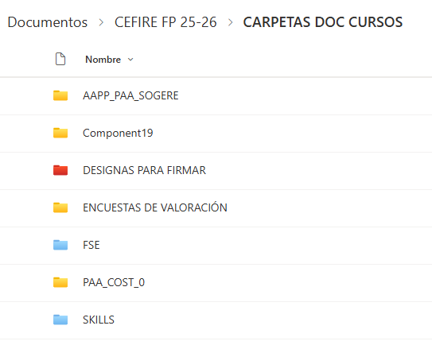

Una formació té diversos passos a seguir; en aquesta part abordarem el disseny de la mateixa, però cal tindre en compte que si aquesta fase no es realitza correctament, pot afectar la gestió posterior de la formació i la correcta justificació de les despeses. Per tant, podria donar-se el cas que la formació no es puga pagar.

El disseny de la formació és fonamental, ja que defineix l’abast del curs, els recursos necessaris i els objectius que es volen assolir. En aquest pas, l’assessor/a inicia la comunicació amb els centres i recopila tota la informació necessària per a elaborar una proposta sòlida i coherent amb les necessitats dels participants.

Tota la documentació del curs s’haurà d’arxivar a la carpeta corresponent dins del canal de TEAMS "Gestió de cursos CEFIRE". És imprescindible seguir el protocol indicat per a l’enviament de documentació.

[:material-folder: Carpeta de Cursos]({{enlaces.carpeta_cursos}}){: .md-button target="_blank"}

A la carpeta trobem les subcarpetes següents:

{: .center }

Aquesta divisió es fa perquè cadascun dels cursos es paga amb campanyes diferents, per això el primer que hem de fer és tindre una campanya assignada al curs.  
A més a 

---  

### **Detecció de necessitats**
El primer que has de tenir clar són que el curs responga a unes necessitats formatives reals i que estiga ben dissenyat. Per a això, és important que es realitze un estudi de necessitats formatives i que es tinga en compte la normativa vigent, per això es fa un formulari de necessitats formatives a tots els centres a principi de curs.

[:material-microsoft-excel: Formulari]( {{enlaces.formulari_deteccio_necessitats}} ){: .md-button target="_blank"}  

!!!info 
    Cal duplicar el formulari.

 ---

### **Definició de la formació**
Amb les necessitats clarament identificades, l’assessor/a defineix la temàtica de la formació i selecciona els ponents més adequats, **donant preferència als professionals de la GVA**. En aquesta etapa es determinen també els objectius específics del curs, la durada prevista, el nombre de sessions i el tipus de modalitat (presencial, online o híbrida). Aquesta definició inicial és essencial per planificar adequadament els recursos i la logística del curs.    
És molt important tindre en compte quina documentació haurem de demanar als ponent per a fer el pagament, ja que hi ha varies casuístiques en funció del tipus de ponent:

* **Jo mateix**: 
    - És recomanable com a assessor del CEFIRE crear algun curs i impartir-lo.
    - En aquest cas **NO** cal fer la **FITXA ECONÒMICA**, ja que no es paga res.
    - Hi ha que fer l'Autorització d'ús de materials oberts" i l'Autorització de gravació i difusió.
    - En aquest cas la campanya s'anomena **PAA CEFIRE**.

* **Ponent de la GVA**: 
    - És l'opció més recomanable de totes per a fer pagament.
    - És la menys problemàtica i cal fer la **FITXA ECONÒMICA** i especificar-ho en observacions que el ponent és de la GVA.
    - A més a més, cal informar al ponent que ha de d'emplenar els documents de "l'Autorització d'ús de materials oberts" i "l'Autorització de gravació i difusió".

* **Ponent extern**: 
    - En aquest cas caldrà especificar-ho en observacions a la **FITXA ECONÒMICA** qu és "un ponent NO GVA".
    - A més a més, cal informar al ponent que ha de d'emplenar els documents de "l'Autorització d'ús de materials oberts" i "l'Autorització de gravació i difusió".
    - També, s'ha de fer un **Informe de necessitat de contractació**, on es justificarà perquè hem contractat a un ponent extern. Aquest informe s'ha de desar en la carpeta del curs i serà signat per el director del CEFIRE d'FP. També caldrà adjuntar el **currículum del ponent**.
    - S'haurà de comprovar si està donat d'alta en Gesfrom, si no ho està caldrà que el donen de alta en Gesform.

* **Empresa externa** (**És l'opció menys recomanable**): 
    - És l'opció menys recomanable de totes, la que més problemes dona i la que cal estar més justificada.
    - És molt fàcil equivocar-se i que hi haja problemes amb el pagament.
    - S'haurà de comprovar si el ponent de la empresa està donat d'alta en Gesfrom, si no ho està caldrà que el donen de alta en Gesform.
    - En aquest cas és necessari omplir els següents documents:
        - **Fitxa econòmica**
        - **Informe de necessitat de contractació de l'empresa**
        - **Autorització d'ús de materials oberts**
        - **Autorització de gravació i difusió**
        - **Factura proforma** de l'empresa degudament complimentada amb totes les dades necessàries:
            * Dades de l'empresa
            * Dades del CEFIRE
            * Dades del curs: CODI i NOM
            * Import brut
            * Import total
            * Número total d'hores de la formació
            * Número de participants
            * Dates de realització de la formació
            * Família professional
            <!-- * IVA corresponent: cal afegir la coletilla  
              "Factura exenta de IVA según art. 20.1.9 de la ley 37-1992 de 28 de diciembre" si l'empresa està exempta d'IVA. -->
            * Número de compte bancari on s'ha de fer el pagament
        - Cal advertir a l'empresa que haurà de ppujar la **factura a la plataforma FACE**, que és la plataforma de gestió de factures electròniques del Ministeri d'Hisenda. Teniu tota la documentació als [següent document que caldrà facilitar a l'empresa]( {{enlaces.instruccions_FACE}} ){target="_blank"}. Per tant és important que l'empresa tinga un usuari registrat en aquesta plataforma i que puga pujar la factura correctament.
        - **Cal insistir que la factura no es pot pujar a la plataforma FACE fins que no s'haja finalitzat la formació**.

!!!warning "Atenció - Alta en FACE"
    Heu de tenir en compte que les factures han d'estar donades d'alta en FACE, per tant, l'empresa suministradora serà l'encarregada de donar d'alta la factura en el sistema. El sistema FACE és un sistema de gestió de factures electròniques que permet a les empreses presentar les seues factures a l'administració pública de manera electrònica. Se li pot facilitar la següent documentació a la empresa: [:material-microsoft-word: Documentació per a l'empresa FACe]( {{enlaces.instruccions_FACE}} ){: .md-button target="_blank"} 

A continuació podeu vore una taula resum:

  <table>
    <thead>
      <tr>
        <th>Ponent</th>
        <th>Jo mateixa</th>
        <th>Ponent de la GVA</th>
        <th>Ponent Extern</th>
        <th>Empresa externa</th>
      </tr>
    </thead>
    <tbody>
      <tr>
        <td>Fitxa Económica</td>
        <td></td>
        <td>✓</td>
        <td>✓</td>
        <td>✓</td>
      </tr>
            <tr>
        <td>Autorització d'ús de materials oberts</td>
        <td>✓</td>
        <td>✓</td>
        <td>✓</td>
        <td>✓</td>
      </tr>
      <tr>
        <td>Autorització de gravació i difusió</td>
        <td>✓</td>
        <td>✓</td>
        <td>✓</td>
        <td>✓</td>
      </tr>
      <tr>
        <td>Informe de necessitats</td>
        <td></td>
        <td></td>
        <td>✓</td>
        <td>✓</td>
      </tr>
      <tr>
        <td>Factura proforma</td>
        <td></td>
        <td></td>
        <td></td>
        <td>✓</td>
      </tr>
      <tr>
        <td>Una vegada estiga acabada la formació pujar factura a FACE</td>
        <td></td>
        <td></td>
        <td></td>
        <td>✓</td>
      </tr>

    </tbody>
  </table>

### **Ús de materials que s'utilitzen en la formació**

⚠️ Si la formació **necessita de materials per a poder realitzar-se** (cables, folis, flores, motoserra, alumini, estany per a soldar, etc...) caldrà especificar-ho a la FITXA ECONÒMICA i adjuntar un informe de necessitat de contractació de materials.

!!!warning "Atenció"
    Els materials que es compren per a fer les formacions han de ser materials **NO INVENTARIABLES**. No es pot adquirir un llibre, o un dispositiu electrònic, o qualsevol altre material que puga ser inventariat. Els materials han de ser consumibles, i que no tinguen altre contracte associat amb l'administració com ara paper, cartutxos d'impressora, etc.

!!!warning "Errades comuns"
    És molt habitual crear un informe copiant i pegant del model. **Utilitzeu el model com a referència**, però no copieu i pegueu el text. És important que **el text siga original i que s'adapte a les necessitats del curs**. A més, cal tindre en compte que si es copia i pega el text, pot haver-hi errades de format o de contingut que poden afectar la justificació de les despeses.

### **Alta en PROPER**
⚠️ **"IMPORTANT - PONENTS ALTA EN PROPER PER A PODER COBRAR"**  
Els ponents han de donar-se d’alta al procediment **PROPER** i enviar-nos el corresponent justificant. Els comptes que els comptes siguin **personals i nominals**.  
[Enllaç a PROPER]( {{enlaces.proper}} ){target="_blank"}

El **PROPER caduca als 3 mesos**, per tant, han de donar-se d'alta quan acaben la formació (si ja estan deurien de tornar-se a donar d'alta).

### **Tarifes**
**És imprescindible que els pagaments s'adeqüen a les tarifes vigents**, per això caldrà que consulteu les tarifes vigents per a l'any en curs. Podeu trobar les tarifes vigents al següent enllaç:

* [Tarifes]( {{enlaces.tarifes_2025}} ){: .md-button target="_blank"}  
* [Annex Tarifes]( {{enlaces.tarifes_2025_annex}} ){: .md-button target="_blank"}  

---  

### **Proposta de la formació**
Uan vegada definida la formació, s'omli en un **full de càlcul** tota la informació bàsica: títol del curs, durada, horaris previstos, ponents, nombre de participants estimat i necessitats logístiques; indicant la **campanya a la qual pertany el curs** (SKILLS, FSE o PAA). Açò es realitza per a que el cap de servei de formació i orientació o el director del CEFIRE d'FP, ens autoritzen a realitzar la formació.

[:material-microsoft-excel: Full de càlcul de les formacions 2025]( {{enlaces.full_calcul_formacions_25}} ){: .md-button target="_blank"}  
[:material-microsoft-excel: Full de càlcul de les formacions 2026]( {{enlaces.full_calcul_formacions_26}} ){: .md-button target="_blank"}

---

### **Validació**
Finalment, la proposta de formació haurà de ser validada per el cap de servei de formació i orientació o el director del CEFIRE d'FP. Aquesta validació és imprescindible abans de començar amb la gestió administrativa, ja que garanteix que la formació s’ajusta a les prioritats de la DGFP i compleix amb els requisits de qualitat establerts.

---

