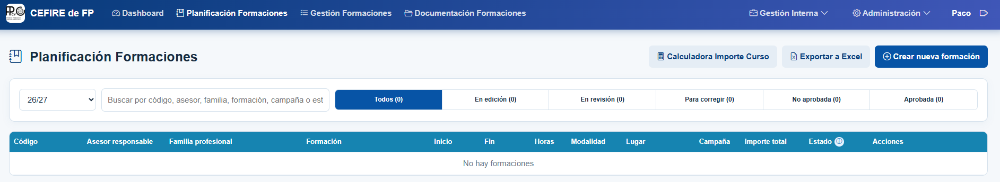

Una formació té diversos passos a seguir; en aquesta part abordarem el disseny de la mateixa, però cal tindre en compte que si aquesta fase no es realitza correctament, pot afectar la gestió posterior de la formació i la correcta justificació de les despeses. Per tant, podria donar-se el cas que la formació no es puga pagar.

El disseny de la formació és fonamental, ja que defineix l’abast del curs, els recursos necessaris i els objectius que es volen assolir. En aquest pas, l’assessor/a inicia la comunicació amb els centres i amb els ponents, i recopila tota la informació necessària per a elaborar una proposta sòlida i coherent amb les necessitats dels participants.

Tota la documentació del curs s’haurà d’arxivar a la carpeta corresponent dins del canal de TEAMS "Gestió de cursos CEFIRE". És imprescindible seguir el protocol indicat per a l’enviament de documentació.

!!!warning "Important"
    Les carpetes dels cursos s’hauran de guardar dins de la carpeta corresponent a la campanya a què pertany el curs: **AAPP, PAA o FSE**.

[:material-folder: Carpeta de Cursos]({{enlaces.carpeta_cursos}}){: .md-button target="_blank"}

---  

### 📝 **Definició de la formació**

Abans de començar a definir la formació, cal tindre clar a quina campanya pertany el curs que es vol proposar: **AAPP, PAA o FSE**. Aquesta classificació és necessària per a arxivar correctament la documentació i planificar els recursos econòmics corresponents.

Una vegada identificades clarament les necessitats formatives i assignada la campanya, l’assessor/a defineix la temàtica de la formació i selecciona els ponents més adequats, **prioritzant els professionals de la GVA**. En aquesta fase també s’estableixen els objectius específics del curs, la durada prevista, el nombre de sessions i la modalitat de realització (presencial, en línia o híbrida). Aquesta definició inicial és fonamental per a garantir una correcta planificació dels recursos i de la logística necessaris.

Cal tindre en compte els criteris següents segons el tipus de formació:

| Tipus de formació | Durada | Observacions |
| --- | --- | --- |
| **Jornada o jornades** | Entre 8 i 20 hores | No es permet la compra de material. |
| **Taller** | Entre 8 i 20 hores | — |
| **Curs** | Entre 20 i 100 hores | — |

### 👥 Tipus de ponents

En les accions formatives del CEFIRE existeixen quatre tipus de ponents. És important seleccionar correctament el tipus de ponent, ja que d’això dependrà la documentació que caldrà tramitar i la forma en què es realitzarà el pagament.

| Tipus de ponent | Quan s’utilitza | Forma de pagament | Documentació necessària* |
| --- | --- | --- | --- |
| **Jo mateix (assessor/a del CEFIRE)** | Quan l’assessor/a del CEFIRE imparteix la formació. | No hi ha remuneració econòmica. | <ul><li>Autorització d’ús de materials oberts.</li><li>Autorització de gravació i difusió.</li><li>Campanya: **PAA CEFIRE**.</li></ul> |
| **Ponent de la GVA** | Docent o professional que presta serveis per a la Conselleria d’Educació. | Mitjançant minuta. | <ul><li>Fitxa econòmica.</li><li>Autorització d’ús de materials oberts.</li><li>Autorització de gravació i difusió.</li></ul> |
| **Ponent no GVA (assalariat)** | Aquesta modalitat està destinada a persones que **no pertanyen a la Conselleria d’Educació** i que imparteixen la formació a títol personal.  Pot tractar-se de:<ul><li>Un treballador assalariat d’una empresa.</li><li>Un professional autònom que, excepcionalment, **no emet factura** i percep la remuneració mitjançant minuta.</li><li>S’haurà de comprovar si està donat d’alta en Gesform; si no ho està, caldrà donar-lo d’alta.</li></ul> | Mitjançant minuta. | <ul><li>Fitxa econòmica.</li><li>Autorització d’ús de materials oberts.</li><li>Autorització de gravació i difusió.</li><li>Informe de necessitats.</li></ul> |
| **Ponent no GVA (autònom o empresa)** | Autònom que factura els seus serveis o empresa que factura la formació. | Mitjançant factura electrònica a través de FACE. | <ul><li>Fitxa econòmica.</li><li>Autorització d’ús de materials oberts.</li><li>Autorització de gravació i difusió.</li><li>Informe de necessitats.</li><li>Factura proforma.</li><li>Una vegada acabada la formació, pujar la factura a FACE.</li></ul> |

#### ⚠️ Cas especial: ponent no GVA (autònom o empresa)

!!!danger "Requisit obligatori de facturació electrònica per a ponent no GVA (autònom o empresa)"
    Cal comprovar que el ponent (autónom) o l’empresa:

    * Disposa dels mitjans, certificats i coneixements necessaris per a emetre factures electròniques.
    * Sap presentar correctament la factura a través de **FACe**, sense assistència per part del CEFIRE.
    * Es compromet a incloure en la factura totes les dades administratives facilitades per l’assessor/a.
    * Omplirà i signarà la **Declaració responsable sobre la capacitat per a l’emissió i presentació de factures electròniques**. Es realitza en l'apliació del CEFIRE

    **La capacitat per a emetre i presentar factures electròniques mitjançant FACe és un requisit indispensable per a la contractació. No s’ha de proposar la contractació de persones o empreses que no puguen complir aquests requisits.**

  

!!!danger "MOLT IMPORTANT: REQUISITS per a autònoms i empreses"
    La documentació indicada s’ha d’emplenar utilitzant l’aplicació de la Conselleria d’Educació.

    **1. Informe de necessitats**

    És obligatori elaborar un **Informe de necessitats de contractació** que justifique detalladament la contractació del ponent autònom o de l’empresa. L’informe s’ha de guardar en l’aplicació i en la carpeta del curs.

    **2. Pressupost o factura proforma**

    El ponent autònom o l’empresa ha de presentar un **pressupost o una factura proforma** abans de la realització de la formació. El document ha d’incloure totes les dades següents i s’ha de pujar a l’aplicació:

    * Dades de l’empresa o del professional.
    * Dades del CEFIRE.
    * Dades del curs: codi i nom.
    * Import brut i import total.
    * Nombre total d’hores de la formació.
    * Nombre de participants.
    * Dates de realització de la formació.
    * Família professional.
    * Número de compte bancari on s’ha de fer el pagament.

    **3. Factura electrònica i FACE**

    **És molt important que l’autònom o l’empresa estiga donat d’alta en FACE** per a poder presentar la factura electrònica. Una vegada finalitzada la formació, haurà de pujar la factura electrònica a la plataforma FACE. També haurà de fer una factura en PDF.  
        
    Les dades per a pujar les factures a FACE son:
    
     - **Si la formació es del FSE** en el [següent document teniu tota la informació que caldrà facilitar a l'empresa]( {{enlaces.instruccions_FACE_DGFP}} ){target="_blank"}.
     - **Si la formació es de PAA o AAPP** en [este altre document teniu tota la informació que caldrà facilitar a l'empresa]( {{enlaces.instruccions_FACE_SDGFP}} ){target="_blank"} 
    
    **Cal insistir que la factura no es pot pujar a la plataforma FACE fins que no s'haja finalitzat la formació**.

!!!warning "Atenció - Alta en FACE"
    Heu de tenir en compte que les factures han d'estar donades d'alta en FACE, per tant, l'empresa suministradora serà l'encarregada de donar d'alta la factura en el sistema. El sistema FACE és un sistema de gestió de factures electròniques que permet a les empreses presentar les seues factures a l'administració pública de manera electrònica. Se li pot facilitar la següent documentació a la empresa:  
    [:material-microsoft-word: Documentació FACe per a l'empresa per a formacions FSE]( {{enlaces.instruccions_FACE_DGFP}} ){: .md-button target="_blank"} [:material-microsoft-word: Documentació FACe per a l'empresa per a formacions PAA / AAPP]( {{enlaces.instruccions_FACE_SDGFP}} ){: .md-button target="_blank"}

!!!note "Video explicatiu de com fer una factura electrònica en Facturae i pujar-la a FACE"
    Video explicatiu per a saber de qué parlem quan demanem a les empreses que ens pugen la factura electrònica a FACE. **Cal tindre en compte que una factura electrònica no és una factura en pdf**. La factura electrònica és realitza mitjançant algún programa de gestió, amb algún programa de comptabilitat (Contaplus, Contasol,...) o amb el programa gratuït de Hisenda FACTURAE. Després, l'empresa ha de pujar a FACE la factura electrònica, o bé mitjançant la web de FACE o bé mitjançant el programa FACTURAE.  
    [:material-youtube: Video explicatiu de com fer una factura electrònica en Facturae i pujar-la a FACE](https://www.youtube.com/watch?v=bd5tSTkyua0){: .md-button target="_blank"} 

A continuació podeu vore una taula resumde la documentació que generará l'aplicació del CEFIRE:

  <table>
    <thead>
      <tr>
        <th>Ponent</th>
        <th>Jo mateix (assessor/a del CEFIRE)</th>
        <th>Ponent de la GVA</th>
        <th>Ponent no GVA (assalariat)</th>
        <th>Ponent no GVA (autònom o empresa)</th>
      </tr>
    </thead>
    <tbody>
      <tr>
        <td>Fitxa Económica</td>
        <td></td>
        <td>✓</td>
        <td>✓</td>
        <td>✓</td>
      </tr>
            <tr>
        <td>Autorització d'ús de materials oberts</td>
        <td>✓</td>
        <td>✓</td>
        <td>✓</td>
        <td>✓</td>
      </tr>
      <tr>
        <td>Autorització de gravació i difusió</td>
        <td>✓</td>
        <td>✓</td>
        <td>✓</td>
        <td>✓</td>
      </tr>
      <tr>
        <td>Informe de necessitats</td>
        <td></td>
        <td></td>
        <td>✓</td>
        <td>✓</td>
      </tr>
      <tr>
        <td>Factura proforma</td>
        <td></td>
        <td></td>
        <td></td>
        <td>✓</td>
      </tr>
      <tr>
        <td>Una vegada estiga acabada la formació pujar factura a FACE</td>
        <td></td>
        <td></td>
        <td></td>
        <td>✓</td>
      </tr>

    </tbody>
  </table>

### 📚 **Ús de materials que s'utilitzen en la formació**

⚠️ Si la formació **necessita de materials per a poder realitzar-se** (cables, folis, flores, motoserra, alumini, estany per a soldar, etc...) caldrà especificar-ho a la FITXA ECONÒMICA i adjuntar un informe de necessitat de contractació de materials.

!!!warning "Atenció"
    Els materials que es compren per a fer les formacions han de ser materials **NO INVENTARIABLES**. No es pot adquirir un llibre, o un dispositiu electrònic, o qualsevol altre material que puga ser inventariat. Els materials han de ser consumibles, i que no tinguen altre contracte associat amb l'administració com ara paper, cartutxos d'impressora, etc.

!!!warning "Errades comuns"
    És molt habitual crear un informe copiant i pegant del model. **Utilitzeu el model com a referència**, però no copieu i pegueu el text. És important que **el text siga original i que s'adapte a les necessitats del curs**. A més, cal tindre en compte que si es copia i pega el text, pot haver-hi errades de format o de contingut que poden afectar la justificació de les despeses.

### 🗂️ **Alta en PROPER**
⚠️ **"IMPORTANT - PONENTS ALTA EN PROPER PER A PODER COBRAR"**  
Els ponents han de donar-se d’alta al procediment **PROPER** i enviar-nos el corresponent justificant. Els comptes que els comptes siguin **personals i nominals**.  
[Enllaç a PROPER]( {{enlaces.proper}} ){target="_blank"}

El **PROPER caduca als 3 mesos**, per tant, han de donar-se d'alta quan acaben la formació (si ja estan deurien de tornar-se a donar d'alta).

### 💶 **Tarifes**
**És imprescindible que els pagaments s'adeqüen a les tarifes vigents**, per això caldrà que consulteu les tarifes vigents per a l'any en curs. Podeu trobar les tarifes vigents al següent enllaç:

* [Tarifes]( {{enlaces.tarifes_2025}} ){: .md-button target="_blank"}  
* [Annex Tarifes]( {{enlaces.tarifes_2025_annex}} ){: .md-button target="_blank"}  

!!!warning "Tarifes de tutorització"
    La tarifa base de tutorització cobreix fins a un màxim de 30 hores de curs. En cas que la durada del curs supere les 30 hores, l’import de la tutorització es calcularà de manera proporcional mitjançant una regla de tres, prenent com a referència la tarifa establerta.  
    Per exemple, si la tarifa base és de 300 € per cada 8 hores de tutorització, en un curs de 33 hores el cost total de la tutorització s’ajustarà proporcionalment, resultant en un import de 1.237,50 €.

---  

### 📄 **Planificació de la formació - Sol·licitud de formació**
Una vegada definida la formació, cal introduir en l’aplicació del CEFIRE d’FP tota la informació bàsica: títol del curs, durada, horaris previstos, ponents, nombre estimat de participants i necessitats logístiques. També cal indicar la **campanya a la qual pertany el curs**: **AAPP, PAA, FSE o Skills**.

Tota la informació de la formació s’introdueix directament en l’aplicació del CEFIRE d’FP. 

[:material-open-in-new: Aplicació del CEFIRE d’FP]( {{enlaces.aplicacio_cefire_fp}} ){: .md-button target="_blank"}

En l’aplicació, cal accedir a la pestanya **Planificación Formaciones**. Des d’aquest apartat es pot iniciar una nova sol·licitud polsant el botó **Crear nueva formación**.

{: .center}

L’aplicació mostra un assistent (*wizard*) que guia l’usuari pas a pas. Cal emplenar totes les dades de la formació i revisar-les abans de polsar el botó **Solicitar**.

Una vegada enviada, la formació passarà pels estats següents:

| Estat | Descripció |
| --- | --- |
| **En edició** | La formació és un esborrany i es poden completar o modificar les dades abans d’enviar-la a revisió. |
| **En revisió** | La formació s’ha enviat perquè l’administració la revise i la valide. |
| **Per corregir** | La revisió ha detectat canvis necessaris. Cal revisar el motiu, corregir les dades i tornar a enviar-la. |
| **No aprovada** | La formació no ha estat aprovada i no pot continuar com a formació vàlida. |
| **Aprovada** | La formació ha estat validada i passa a **Gestió de Formacions** per a completar-ne la gestió. |

---

### ✔️ **Validació**
Finalment, la proposta de formació haurà de ser validada per el director del CEFIRE d'FP. Aquesta validació és imprescindible abans de començar amb la gestió administrativa, ja que garanteix que la formació s’ajusta a les prioritats de la DGFP i compleix amb els requisits de qualitat establerts.

---

