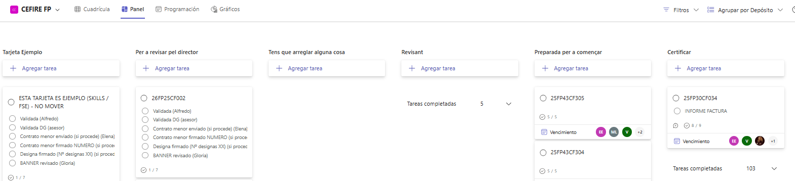

### **Crear el curs en Gesform**
Una vegada tinguen clara la formació i el que necessite caldrà introduïr-la a Gesform. Per a això, caldrà accedir a la plataforma Gesform i donar d'alta la formació. És important que seguisques els passos correctament i que omplis tots els camps necessaris.

[:material-link-variant: Alta Formació en Gesform](../tutorials/tutorial_gesform.md){: .md-button target="_blank"}

!!! note "⏰ Temporització recomanada de les fases d'un curs"
    * 📝 **Fase d’inscripció** → 4 setmanes.
    * ✅ **Fase de confirmació** → 1 setmana.
    * 📋 **Llistat definitiu i inici del curs** → 1 setmana abans de començar.

Una vegada donat de alta el curs en Gesform ens donarà un codi semblant a 2XFPxxCF0xx que l'haurem d'utilitzar per a identificar el curs.  
El curs es quedarà en estat  **INICIAL**, després d'omplir totes les dades del curs en Gesform y omplits tots el documents el poscanviarema a estat **PROPOSTA**.  

---

### **Crear la carpeta i documentació de la formació**

Després d'haurà de crear la carpeta del curs, per a fer-ho utilitzarem l'aplicació crea_carpeta.  
[Aplicació per a crear carpetes de formacions]( {{enlaces.crea_carpeta}}){: .md-button target="_blank"}

!!!warning "Comprovar que tenim en el nostre PC la última versió"
    Si ja tenim l'apliació crea_carpeta baixada en el nostre PC, és molt important comprovar si tenim la última versió, ja que els documents van canviant, i podriem no omplir els que tocara.

L'ús és molt senzill, poseu el vostre nom d'assessor i el codi de la formació i es crearà la carpeta amb totes les subcarpetes i documents necessàris.  

⚠️ **"IMPORTANT - NO ES POT CANVIAR EL NOM DEL LES CARPETES I DOCUMENTS QUE CREA L'APLICACIÓ"** 
  
{: .center}

L'aplicació crearà una carpeta amb el nom "CODI_FORMACIO_NOM_ASSESOR" que tindrà una una sèrie de subcarpetes i documents per a organitzar la documentació del curs. A continuació és resumeixen quines son les subcarpetes i els documments creats, per a saber per a que son:

 * **2xFPxxCF0xx_FITXA ECONÒMICA.xlsx**: És el document més importat, ja que tota la documentació del curs (designa, certifica, etc...) és genera a partir d'este document. En ell es detallen els costos i pressupostos. És imprescindible que REVISAR que esta fitxa estiga ben omplida i no tinga cap errada, les errades de esta fitxa **NO ES PODEN CORREGIR**.
 * **2xFPxxCF0xx_DATOS PONENTE_NOMBRE.pdf**: Es tracta d'un document on es detallen totes les dades del ponent.
 * **2xFPxxCF0xx_AutorizacionUsoMaterialesAbierto**:Autorització per a l'ús de materials oberts per part del ponent, que haurà de signar digitalment.
 * **2xFPxxCF0xx_AutorizacionGrabacionYDifusion**: Autorització per a la gravació i difusió de la formació, és un document que cal omplir i signar digitalment per part del ponent.
 * **2xFPxxCF0xx_PROPER_PONENTE**: És necessari que el ponent es done d'alta el compte on va a rebre el pagament del curs en la plataforma PROPER quan acabe la formació tal i com s'indica en [Alta en Proper](disseny.md#alta-en-proper){target="_blank"}. 
  * **2xFPxxCF0xx_Informe motivado de necesidad de ponente NO FUNCIONARIO CAST**: Si el ponent no és funcionari GVA cal fer un informe de perquè estàs fent esta contractació. 
  * **2xFPxxCF0xx_Modelo informe necesidad_VAL_V3.docx**: Si el ponent no és funcionari GVA cal fer un informe de perquè estàs fent esta contractació. 
 * **2xFPxxCF0xx-Tec**: Subcarpeta on es posaran totes les evidències necessàries per a justificar la formació. 
 * **2xFPxxCF0xx_CuadroTexto**: Es troba dins de la carpeta 2xFPxxCF0xx_CuadroTexto, i és un formulari que cal emplenar. 
 * **2xFPxxCF0xx_Evidencias**: Es troba dins de la carpeta 2xFPxxCF0xx_CuadroTexto, i és un document on es posaran captures de totes les evidències necessàries per a justificar la formació. Baners, publicació en web, fotos, etc... .
 * **2xFPxxCF0xx_FSE_Ficha_seguimiento**: Es troba dins de la carpeta 2xFPxxCF0xx_CuadroTexto, i és s'inidcarna els continguts del curs, etc.
  * **2xFPxxCF0xx_crea_designa.exe**: És una aplicació que crearà el designa del ponent.

⚠️ **"IMPORTANT - NO ES POT CANVIAR EL NOM DEL LES CARPETES I DOCUMENTS QUE CREA L'APLICACIÓ"** 
 
La carpeta creada la guardarem dins de la carpeta de cursos:  
 [:material-folder: Carpeta de Cursos]( {{enlaces.carpeta_cursos}} ){: .md-button target="_blank"}

---

### **Fitxa Econòmica**
**Document 2xFPxxCF0xx_FITXA ECONÒMICA.xlsx**  

La **fitxa econòmica** és un document **OBLIGATORI** que s’ha d’elaborar en **TOTS ELS CASOS** quan es crea una acció formativa. És l’eina que assegura la coherència entre la planificació pedagògica i la gestió econòmica del curs, ja que de la seua correcta elaboració dependrà tota la documentació posterior (contractes, justificacions, informes, etc.).

Per això és fonamental que **estiga omplida amb rigor i SENSE ERRORS**, ja que qualsevol incongruència pot generar retards o problemes en el procés de validació i pagament.

**Aspectes clau que cal tindre en compte**

* La fitxa econòmica ha d’estar **correctament omplida en totes les seues parts**.
* El **títol de la formació** ha de possar-se **en valencià**. (Açò es degut a que a partir de la fitxa econòmica es crea el DESIGNA, el qual està redactat en valencià).
* El format de les **dates de la formació** ha de seguir el patró **"del DD/MM/AA al DD/MM/AA"**.
* En cada linea del document, s'ha de possar totes les dades del ponent o de la empresa. Per example, si un ponent a banda de pagar-li per la tutorització se li paga per creació de materials, s'haurà d'omplir dos lines amb totes les dades del ponent.
* **Tota la documentació administrativa** (contractes, informes, propostes, justificacions…) es genera a partir d’aquesta fitxa, per tant és el **document base**.
* El **pressupost indicat** ha de coincidir **exactament** amb el que s’ha introduït en GESFORM.
* Han d’estar inclosos **tots els noms dels ponents**, sense faltes d’ortografia i amb el **format establit en GESFORM** (majúscules).
* Cal comprovar que hi consten totes les **dades requerides**: hores de docència, tarificació, preu per hora, i el **preu total** de la formació.
* La fitxa econòmica ha d’estar **signada tant per l’assessor/a responsable com pel director/a del CEFIRE**.
* El document s’ha de lliurar en **dos formats**:
    - Excel (editable).
    - PDF signat digitalment per l'assessor (versió oficial).  

---  

### **Designa**
**Document 2xFPxxCF0xx_DESIGNA_Nombre_Apellido1_Apellido2.xlsx**  

El **“DESIGNA”** és un document administratiu que serveix per a **formalitzar la designació d’un ponent o formador per a una activitat formativa concreta**, com ara una formació FSE o SKILLS dins del CEFIRE. És una manera oficial de deixar constància que una persona concreta ha estat seleccionada per impartir la formació i que la seva participació està autoritzada i validada per la direcció.  

El document **“DESIGNA”** es genera amb l'aplicació 2xFPxxCF0xx_crea_designa.exe, no obstant, hi ha que revisar-lo per si hi haguerem comés algun error omplint la fitxa econòmica. 

Este document ha de ser signat per el/la director(a) de la Direcció General de Formació Professional. Per tant, una vegada generat es possarà una còpia en la carpeta [DESIGNA POR FIRMAR]( {{enlaces.carpeta_desgina_per_firmar}} ){target="_blank"}.  

Posteriorment, **abans de que comence la formació** (aproximadament uns 3-5 dies abans), l'assessor haurà de **comprovar que el DESIGNA estiga signat** en la [carpeta de designes firmats]( {{enlaces.designa_firmado}} ){target="_blank"}.

!!!warning "Comprovar que el DESIGNA estiga signat abans de começar la formació"
    Si el DESIGNA no està signat NO es pot començar la formació, i caldria possar-se en contacte amb el Director del CEFIRE d'FP per a vore qué ha pasat i canviar les dates

Una vegada ho comprovem haurem d'anar al [KANBAN](  {{enlaces.kanban}} ){target="_blank"} i anotar-ho el la tasca marcant el check de l'element designa dela tarjeta de la formació. Vore apartat [Tarjeta KANBAN](#tarjeta-kanban){target="_blank"}

!!!warning "Atenció"
    El Designa es fa en tots els casos menys quan es tracta d'una empresa, que en eixe cas es fa un contracte menor.

---

### **Informe de necessitats de contractació de personal no GVA**
**2xFPxxCF0xx_Informe motivado de necesidad de ponente NO FUNCIONARIO CAST**  

Quan una formació NO és impartida per personal de la **GVA**, és obligatori preparar un **informe de necessitat**, ja que aquest document justifica la contractació i és imprescindible per a tramitar el curs.

### **Informe de necessitats de contractació d'una empresa**
**Documento 25FP25CF015_Modelo informe necesidad_VAL_V3.docx** 

**Si es tracta d’una empresa** que s'ha contractat per a impartir la formació i/o suministrar el material necessari per a realitzar la formació s’ha d’elaborar l’**Informe de necessitat per a fer el contracte menor**. Aquest document ha de ser signat pel director del CEFIRE d'FP.  

En este cas farà falta un contracte menor, del qual s'encarregarà Elena i ens avisarà a través de la [Tarjeta KANBAN del curs](#tarjeta-kanban){target="_blank"}. Alli possarà el número de contracte menor que haurem de facilitar a l'empresa. Fins que no estiga el contracte menor **no es pot començar la formació**.

!!!warning "Contracte menor"
    Fins que no estiga el contracte menor NO es pot començar la formació.

---

### **Banner**
En el cas de les **formacions online**, és obligatori preparar un **banner identificatiu** que s’utilitzarà tant en AULES com en la difusió del curs.

Per a crear el banner és **OBLIGATORI** utilitzar l'aplicació de Creació de Banners.  
[:material-image-area: Creació de Banners](../apps/baner/proves.html){:.md-button target="_blank"} 

Este banner ha d’incloure de manera clara i visible la informació següent:

* **Codi de la formació**.
* **Nom complet de la formació**.
* **Durada total de la formació (hores)**.
* **Logos institucionals que corresponguen**:
    * CEFIRE de FP
    * Generalitat Valenciana (GVA)
    * Ministeri d’Educació
    * Direcció General de FP
    * Fons Social Europeu (FSE)

És molt important que el banner complisca aquests requisits, ja que és la imatge oficial de la formació i garanteix la correcta visibilitat dels programes i institucions que la recolzen.

Una vegada estiga creat el banner de la formació ha de pujar-se a la carpeta corresponent per a revisar que no tinga cap errada:  
[:material-folder: Carpeta de banners]( {{enlaces.carpeta_banners}} ){:.md-button target="_blank"}

El banner serà validat per Gloria, en el cas de que siga correcte, s'afegirà al nom del banner com a sufixe "_OK". Si el banner crear té algun error s'informarà a través de KANBAN (Vore apartat [Tarjeta KANBAN](#tarjeta-kanban){target="_blank"}) i es s'afegirà al nom del banner com a sufixe "_MODIFICAR". Una vegada subsanat l'errada és renombrarà a "_CORREGIT" i s'avisarà a Gloria.  

---
### **Sol·licitut d'espais del centre**
Si la formació es presencial en algún centre, s'haurà de demanar permís al centre en qüestió. Es per allo que haurem d'amplir el [següent document]({{enlaces.solicitut_espais_centre}}){:target="_blank"} i l'il tenim que enviar al director del centre per a que ens el signe.
El document el guardarem en la carpeta del curs amb en nom **2xFPxxCF0xx_Solicitud de Espacios.PDF**.

---

### **Tarjeta KANBAN**
Una vegada tinguem la formació introduida en Gesfrom i omplit tota la documentació esmentada abans, avisarem a través de **[KANBAN]( {{enlaces.kanban}} ){target="_blank"}** per a que ens validen la formació.  
Per a avisar haurem de generar una nova tarjeta (copiant la tarjeta d'exemple) amb el codi de la formació, i la posarem en la columnna **"Per a Revisar per director"**.  

La **tarjeta és dinàmica** i tindrem que anar revisant-la i treballant sobre ella, per tant, cal tindre en compte els següents aspectes:

* La tarjeta ens l'**assignarem a nosaltres i a Gloria i a Alfredo**, per cal d'estar informats en cada canvi d'estat.  
* Si en **la formació intervé una empresa** i per tant hem tingut que fer un "informe de necessitats de contractació d'una empresa", també haurem d'**etiquetar a Elena**. En este cas, Elena possarà el número de contracte menor (el qual haurem de facilitar a l'empresa) dins de la tarjeta Kanban. Recorda que la formació no es pot començar si no està el contracte menor.
* Revisarem en Gesform quan la DG ens valide la formació, en eixe moment, clickarem en "Validada (DG).
* Quan tinga'm el designa signat (recordar que s'ha de revisar 3-5 dies abans del començament de la formació, i si no està signat no es pot començar la formació), clicarem en "Designa firmado".
* Una vegada validat el banner, clicarà "Banner revisado".

Tal i com s'ha comentat abans, la tarjeta és dinàmica i anirà movent-se entre les columnes, a continuació s'explica cada columna i el fluxe que pot tindre la tarjeta:

* **Per a revisar pel director**.- Açí col·locarem la tarjeta quan tinga'm la formació introduida en Gesfrom i omplida tota la documentació.
* **Tens que arreglar alguna cosa**.- El director col·locarà la tarjeta en esta columna quan tinguem que revisar alguna cosa. Dins de la tarjeta en comentaris ens indicarà qué és lo que hem de corregir. Una vegada corregit, mourem la tarjeta a la columna "Per a revisar pel director".
* **Revisant**.- Indica que el director està revisant al formació. En este cas NO podem modificar res de la tarjeta, ni de la formació.
* **Preparada per a començar**.- Indica que tota la documentació de la formació està correcta i validad per el director, i per tant, pot començar.
* **Certificar**.- Una vegada haja acabat la formació i tenim tota la documentació de finalització preparada, moure'm la tarjeta a aquesta columna.

{: .center} 

---

<!--
 * **2xFPxxCF0xx_ACTA FINAL.pdf**: Acta amb els APTES i NO APTES de la formació, cal que estiga degudament omplerta i signada per part del ponent, es trau de gesform.
 * **2xFPxxCF0xx_ACTA PONENT.pdf**: Acta signada pel ponent on posa els APTES i NO APTES de la formació, la genera ell/a.
 * **2xFPxxCF0xx_SIGNATURES.pdf**: Document amb totes les signatures de la formació escanejades.
 * **2xFPxxCF0xx_DESIGNA_NOM_PONENT_FSE.pdf**: (Convocatòria FSE) Aquest document és necessari per a designar el ponent de la formació, cal que estiga degudament omplert i signat pel cap de servei de formació i orientació i pel subdirector general, caldrà facilitar-lo per la plataforma Kanban que hem habilitat per a que es signe. [Podeu trobar el document ací]( {{enlaces.designa_fse}} ){target="_blank"}.
 * **2xFPxxCF0xx_DESIGNA_NOM_PONENT_SKILLS.pdf**: (Convocatòria SKILLS) Aquest document és necessari per a designar el ponent de la formació, cal que estiga degudament omplit i signat pel cap de servei de formació i orientació i pel subdirector general, caldrà facilitar-lo per la plataforma Kanban que hem habilitat per a que es signe.
     - Si el ponent es **docent GVA** [podeu trobar el document ací]( {{enlaces.designa_skills}} ){target="_blank"}.
     - En el cas que **NO siga docent GVA**, caldrà fer un **informe de necessitat de contractació** i [utilizar aquest document de DESIGNA]( {{enlaces.designa_skills_no_docent}} ){target="_blank"}.
  * **2xFPxxCF0xx_Solicitud de Espacios**: Si la formació es presencial en algún centre, s'haurà de demanar permís al centre en qüestió. Es per allo que haurem d'amplir el [següent document]({{enlaces.solicitut_espais_centre}}){:target="_blank"} i l'il tenim que enviar al director del centre per a que ens el signe. El document el guardarem en la carpeta del curs amb en nom . 

-->
