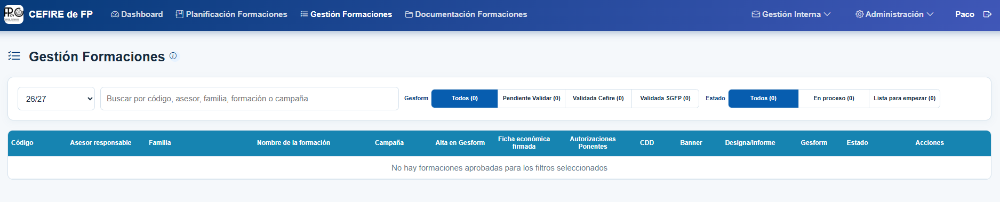
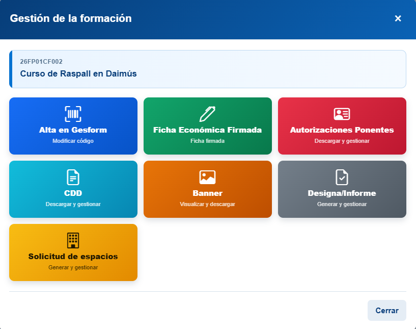
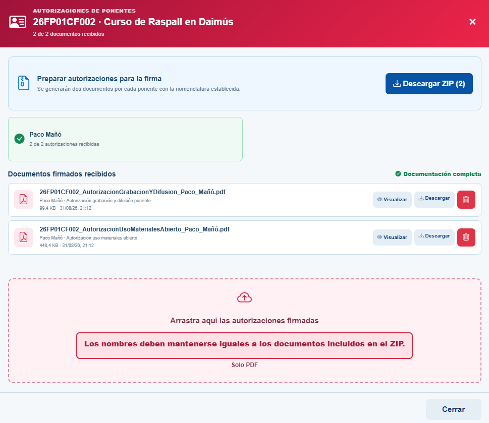
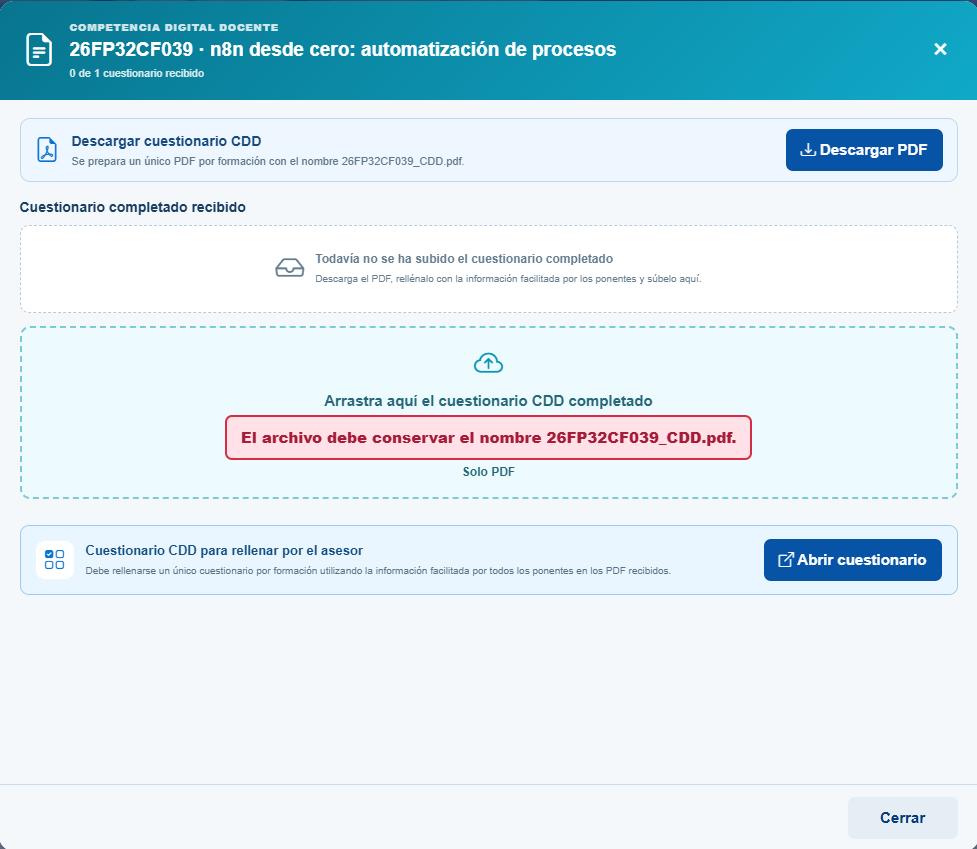
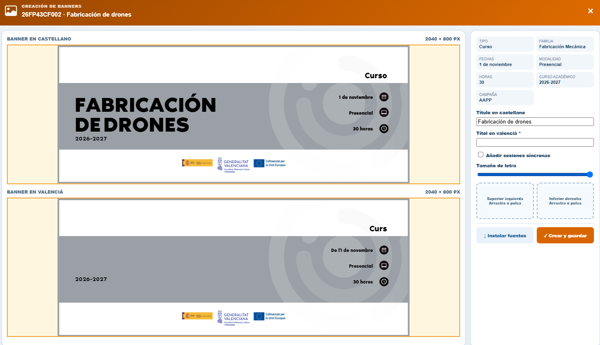

# Gestió de la formació

Una vegada aprovada la formació, aquesta apareixerà en la pestanya **Gestión de la Formación** de l’aplicació. Des d’aquest apartat podrem completar tota la documentació necessària per a iniciar-la.

{: .center}

## Passos principals

1. **Crear el curs en Gesform**.
2. **Completar la documentació en l’aplicació**.

## 1. 📘 Crear el curs en Gesform

Una vegada definida la formació, cal crear el curs en Gesform. Accedeix a la plataforma, crea el curs i emplena correctament tots els camps necessaris.

[:material-link-variant: Alta Formació en Gesform](../tutorials/tutorial_gesform.md){: .md-button target="_blank"}

!!! note "⏰ Temporització recomanada de les fases d'un curs"
    * 📝 **Fase d’inscripció** → 4 setmanes.
    * ✅ **Fase de confirmació** → 1 setmana.
    * 📋 **Llistat definitiu i inici del curs** → 1 setmana abans de començar.

Una vegada donat d’alta el curs, Gesform generarà un codi semblant a **2XFPxxCF0xx**, que utilitzarem per a identificar-lo en tota la documentació.

---

## 2. 📄 Completar la documentació en l’aplicació

Una vegada creada la formació en Gesform, cal completar en l’aplicació del CEFIRE tota la documentació necessària per a poder iniciar el curs. En els apartats següents s’explica què cal preparar en cada cas.

{: .center}

---

### 📝 Alta en Gesform.-  Donar d’alta les dades de la formació en l’aplicació

En l’aplicació del CEFIRE, dins de **Alta en Gesform**, cal donar d’alta les dades de la formació obtingudes en Gesform:

* **Codi del curs**.
* **Data d’inscripció**.
* **Data de confirmació**.
* **Data de les llistes definitives**.

És important respectar l’ordre de les dates: inscripció, confirmació i llistes definitives.

🔄 Estats de la formació

Cal anar actualitzant l’estat de la formació en Gesform a mesura que avance la seua tramitació. Per a canviar-lo, polsa el botó d’actualització i selecciona l’estat corresponent:

| Estat en Gesform | Quan s’utilitza |
| --- | --- |
| **Pendent de validar** | La formació s’ha creat i està pendent de revisió. |
| **Validada CEFIRE** | El CEFIRE ha revisat i validat la formació. |
| **Validada SGFP** | La Subdirecció General de Formació del Professorat ha validat la formació. |

---

### 📑 Fitxa econòmica
La **fitxa econòmica** és un document obligatori quan correspon segons el tipus de ponent. Assegura la coherència entre la planificació pedagògica i la gestió econòmica del curs i és necessària per a preparar la documentació posterior: contractes, justificacions i informes.

La fitxa econòmica la genera l’aplicació. L’assessor/a l’ha de signar mitjançant la mateixa aplicació i, una vegada signada, s’enviarà automàticament al director del CEFIRE perquè la signe. Quan el director l’haja signada, aquest pas quedarà completat.

  
  
  

---  

### 👥 Autoritzacions dels ponents

Des de l’aplicació es generen les autoritzacions que corresponen a cada ponent. Cal descarregar-les i enviar-les als ponents perquè les emplenen i les signen digitalment. Una vegada signades, s’han de pujar de nou a l’aplicació.

Les autoritzacions que cal gestionar són:

* **Autorització d’ús de materials oberts**.
* **Autorització de gravació i difusió**.

Quan s’hagen pujat correctament totes les autoritzacions signades, aquest apartat quedarà completat.

{: .center}

---

### 🗺️💻 Competència Digital Docent (CDD)

El **mapejat de la Competència Digital Docent (CDD)** és un procés obligatori que permet vincular cada acció formativa amb les àrees i nivells del marc de competència digital docent.

##### En quines formacions és obligatori?

El mapejat s'ha de realitzar obligatòriament en:

* Formacions **FSE**
* Formacions **PAA**
* Formacions **SKILLS**
* Altres accions formatives de la mateixa naturalesa

El mapejat s'ha de realitzar independentment de la modalitat de la formació, tant en formacions **presencials** com **en línia**.

##### 🚫 Excepcions

**No s'ha de realitzar el mapejat** en:

* Formacions del **PAF**.
* Jornades.
* Congressos.

#### 📄 Procediment per a completar la CDD

El procediment per a completar la **Competència Digital Docent (CDD)** consta de **dos passos**:

**1. El ponent emplena el qüestionari CDD**

Des de l'aplicació, l'assessor/a haurà de **descarregar el qüestionari CDD corresponent a cada ponent** i enviar-li'l.

El **ponent haurà d'emplenar el qüestionari amb les dades de la formació i signar-lo digitalment**. Una vegada emplenat i signat, haurà de retornar-lo a l'assessor/a.

L'assessor/a haurà de **pujar el document rebut a l'aplicació**.

!!! warning "Important"
    **No s'ha de modificar el nom del fitxer**, ja que el document que es puge a l'aplicació ha de mantindre exactament el mateix nom que tenia quan es va descarregar.

**2. L'assessor/a emplena el formulari CDD**

Una vegada rebuts els qüestionaris emplenats pels ponents, l'assessor/a haurà d'**obrir el formulari CDD disponible en l'aplicació i emplenar-lo amb les dades que han facilitat els ponents** en els seus qüestionaris.

Per tant, cal tindre en compte que:

* **El ponent emplena i signa el seu qüestionari CDD.**
* **L'assessor/a utilitza la informació facilitada pel ponent per a emplenar el formulari CDD en l'aplicació.**

Quan s'hagen pujat tots els qüestionaris dels ponents i l'assessor/a haja emplenat el formulari CDD amb les dades corresponents, **el procediment quedarà completat**.

{: .center}

---

### 🎨 Banner

Cal crear el **banner identificatiu** de la formació des de l’aplicació. Una vegada creat, s’ha d’enviar a través de la mateixa aplicació perquè siga validat.

El banner s’utilitzarà per a la difusió del curs i, quan corresponga, per a Aules en les formacions en línia o semipresencials.

{: .center}

---

### 🧾 Designa / Informe de necessitats

La **designa** i els **informes de necessitats** es gestionen des del mateix apartat de l’aplicació. El document que cal generar depén del tipus de ponent:

| Tipus de ponent | Actuació en l’aplicació | Document o resultat | Signatura |
| --- | --- | --- | --- |
| **Jo mateix** | Marcar la casella corresponent. | No cal generar designa ni informe. | No correspon. |
| **Ponent de la GVA** | Generar la designa i enviar-la des de l’aplicació. | **Designa**. | Director/a de la DGFP en formacions FSE o director/a de la SGFP en formacions AAPP i PAA. |
| **Ponent no GVA (assalariat)** | Descarregar l’informe, emplenar-lo i pujar-lo de nou a l’aplicació. | **Informe de necessitats de contractació de personal no GVA**. | Director del CEFIRE d’FP. |
| **Ponent no GVA (autònom o empresa)** | Descarregar l’informe, emplenar-lo i pujar-lo de nou a l’aplicació.  També cal pujar el **pressupost o la factura proforma** amb totes les dades requerides. | **Informe de necessitats de contractació d’empresa**.  **Pressupost o factura proforma**. | Director del CEFIRE d’FP. |

El document que cal tramitar en aquest apartat depén de la relació del ponent amb l’Administració:

* En el cas d’un **ponent de la GVA**, l’aplicació genera la **designa**, que formalitza la seua participació en la formació. La designa s’envia des de l’aplicació perquè la signe la direcció competent segons la campanya: la DGFP en les formacions FSE, o la SGFP en les formacions AAPP i PAA. La gestió queda completada quan la designa ha estat signada.
* En el cas d’un **ponent no GVA assalariat**, cal elaborar l’**Informe de necessitats de contractació de personal no GVA**. Aquest informe explica i justifica per què és necessari contractar aquesta persona, i l’ha de signar el director del CEFIRE d’FP abans de continuar amb la tramitació del pagament mitjançant minuta.
* En el cas d’un **ponent no GVA autònom o d’una empresa**, cal elaborar l’**Informe de necessitats de contractació d’empresa** i pujar-lo a l’aplicació. Aquest informe justifica la contractació i és necessari per a tramitar el contracte menor. També cal pujar a l’aplicació, abans de la formació, el **pressupost o la factura proforma** amb totes les dades requerides. L’informe l’ha de signar el director del CEFIRE d’FP abans que l’autònom o l’empresa puga presentar la factura electrònica corresponent.

---
### 🏫 Sol·licitud d’espais del centre
Si la formació és presencial en un centre, cal tramitar la sol·licitud d’espais des de l’aplicació. Aquest pas només és necessari quan la formació utilitza les instal·lacions d’un centre educatiu.

1. En l’apartat **Sol·licitud d’espais**, polsa **Generar i descarregar Word** per a descarregar la plantilla en format `.docx`.
2. Emplena el document amb les dades de la formació i desa’l en la carpeta del curs.
3. Envia la sol·licitud al director del centre perquè la revise i la signe.
4. Quan estiga signada, converteix-la a PDF i puja el document signat a l’aplicació.

Quan el PDF signat s’haja pujat correctament a l’aplicació, el pas de **Sol·licitud d’espais** quedarà completat.

---

### 🔄 Estats de les formacions

L’aplicació també mostra un **estat de gestió**, que s’actualitza automàticament segons el progrés de la documentació:

* **En procés**: encara falta completar alguna tasca o document.
* **Llista per a començar**: tota la documentació està completa i la formació consta com a **Validada SGFP** en Gesform.

---

### 📋 Resum de la documentació

A continuació podeu vore una taula resum de la documentació que cal preparar segons el tipus de ponent:

  <table>
    <thead>
      <tr>
        <th>📄 Documentació</th>
        <th>🧑‍🏫 Jo mateix</th>
        <th>🏛️ Ponent GVA</th>
        <th>👤 Ponent NO GVA (cobra amb minuta)</th>
        <th>🏢 Empresa / Autònom (cobra amb factura)</th>
      </tr>
    </thead>
    <tbody>
      <tr>
        <td>Fitxa econòmica</td>
        <td></td>
        <td>✓</td>
        <td>✓</td>
        <td>✓</td>
      </tr>
      <tr>
        <td>Dades del ponent</td>
        <td></td>
        <td>✓</td>
        <td>✓</td>
        <td>✓</td>
      </tr>
      <tr>
        <td>Autorització d’ús de materials oberts</td>
        <td>✓</td>
        <td>✓</td>
        <td>✓</td>
        <td>✓</td>
      </tr>
      <tr>
        <td>Autorització de gravació i difusió</td>
        <td>✓</td>
        <td>✓</td>
        <td>✓</td>
        <td>✓</td>
      </tr>
      <tr>
        <td>CDD</td>
        <td>✓</td>
        <td>✓</td>
        <td>✓</td>
        <td>✓</td>
      </tr>
      <tr>
        <td>DESIGNA</td>
        <td></td>
        <td>✓</td>
        <td>✓</td>
        <td></td>
      </tr>
      <tr>
        <td>Informe de necessitats de contractació de personal no GVA</td>
        <td></td>
        <td></td>
        <td>✓</td>
        <td></td>
      </tr>
      <tr>
        <td>Informe de necessitats de contractació d’una empresa</td>
        <td></td>
        <td></td>
        <td></td>
        <td>✓</td>
      </tr>
      <tr>
        <td>Banner del curs (AULES i difusió)</td>
        <td>✓</td>
        <td>✓</td>
        <td>✓</td>
        <td>✓</td>
      </tr>
      <tr>
        <td>Sol·licitud d’espais del centre (si presencial)</td>
        <td>✓</td>
        <td>✓</td>
        <td>✓</td>
        <td>✓</td>
      </tr>
    </tbody>
  </table>

