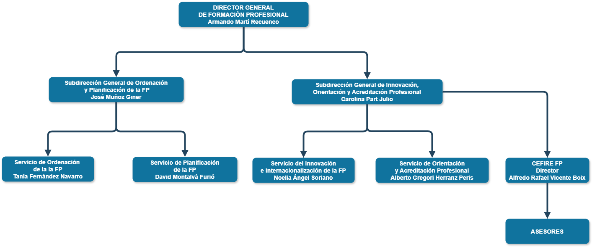

### 🏛 Organigrama

L’organització del **CEFIRE de FP** està estructurada per assegurar una coordinació eficaç entre els assessors, els centres de formació i la Direcció General de Formació Professional.

{: .center}

---

### 👥 Qui som

📌 Aquest apartat inclou informació bàsica de cada assessor/a:

* Nom complet
* Correu electrònic corporatiu
* Telèfon
* Àrea d’especialització
* Ubicació

---

### ⏰ Horari d’atenció

* **Atenció presencial i virtual:** de dilluns a divendres, de 8:30 a 14:30.  
(o de dilluns a divendres, de 9:00 a 14:00 i una vesprada)

---

### 🏫 Directori de centres i directors

Per a facilitar la comunicació amb els centres de FP, amb els directors o amb els cap de departament de cada familia professional en el següent enlla´ç podreu trobar difrents directoris:

* Llistat dels centres de FP de la Comunitat Valenciana
* Directori de directors(es) de centres
* Directori de caps de departament
* ...

[:material-link-variant: Directori de Contactes]({{enlaces.directori_contactes}}){: .md-button target="_blank"}

---

## 🎨 Imatge corporativa

L’aplicació correcta de la **imatge corporativa** és fonamental per a mantenir la coherència i professionalitat de la nostra comunicació. En el Teams podràs trobar:

* Logos oficials
    - Disponible en formats **PNG, JPG i vectorial (SVG)**.
    - Ús recomanat: documents oficials, presentacions, comunicació interna i externa.

* Plantilles
    - Plantilles oficials per a documents (Word i PowerPoint).

* Firma de correu electrònic

* Fons per a Teams per a videoconferències amb identitat corporativa.

* Fons per a formularis de Microsoft Forms

[:material-link-variant: Image Coorporativa]({{enlaces.image_corporativa}}){: .md-button target="_blank"}

---