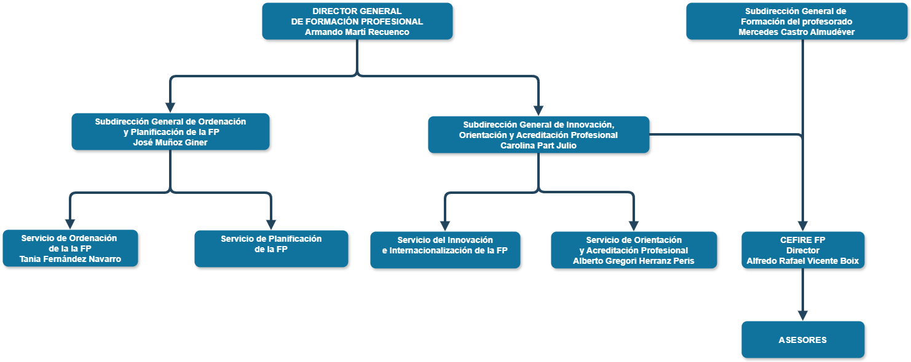

### 🏛 Organigrama

L’organització del **CEFIRE de FP** està estructurada per assegurar una coordinació eficaç entre els assessors, els centres de formació i la Direcció General de Formació Professional.

{: .center}

---

### 👥 Qui som

| Asesor                 | Mail                                                      | Sector                      | Families                                                                                 | Mail Sector                                                     |
| ---------------------- | --------------------------------------------------------- | --------------------------- | ---------------------------------------------------------------------------------------- | --------------------------------------------------------------- |
| Alfredo Rafael Vicente | [ar.vicenteboix@edu.gva.es](mailto:ar.vicenteboix@edu.gva.es)         | Direcció |       | [46402871@edu.gva.es](mailto:46402871@edu.gva.es)               |
| Gloria Muñoz           | [gloria.munoz@gva.es](mailto:gloria.munoz@gva.es)         | Tecnològic                  | Electricitat i electrònica                                                               | [fp_tecnologic@gva.es](mailto:fp_tecnologic@gva.es)             |
| Santiago Peiró         | [santiago.peiro@gva.es](mailto:santiago.peiro@gva.es)     | Tecnològic                  | Informàtica i comunicacions Transport i manteniment de vehicles                       | [fp_tecnologic2@gva.es](mailto:fp_tecnologic2@gva.es)           |
| Anna Guasp             | [anna.guasp@gva.es](mailto:anna.guasp@gva.es)             | Serveis                     | Administració i gestió Comerç i màrqueting Serveis socioculturals i a la comunitat | [fp_serveis@gva.es](mailto:fp_serveis@gva.es)                   |
| José Carlos Denia      | [josecarlos.denia@gva.es](mailto:josecarlos.denia@gva.es) | Industrial                  | Fabricació mecànica Instal·lació i manteniment Energia i aigua                     | [fp_industrial@gva.es](mailto:fp_industrial@gva.es)             |
| Patricia Fuster        | [patricia.fuster@gva.es](mailto:patricia.fuster@gva.es)   | Gestió, comerç i turisme    | Comerç i màrqueting Hostaleria i turisme Administració i gestió                    | [fp_gescomturisme@gva.es](mailto:fp_gescomturisme@gva.es)       |
| Camilo Gisbert         | [camilo.gisbert@gva.es](mailto:camilo.gisbert@gva.es)     | Industrial 2                | Edificació i obra civil Fusta, moble i suro Tèxtil, confecció i pell               | [fp_industrial2@gva.es](mailto:fp_industrial2@gva.es)           |
| Gemma Cerezo           | [gemma.cerezo@gva.es](mailto:gemma.cerezo@gva.es)         | Creatiu                     | Arts gràfiques Imatge personal Imatge i so Vidre i ceràmica                     | [fp_creatiu@gva.es](mailto:fp_creatiu@gva.es)                   |
| Lorena Muñoz           | [lorena.munoz@gva.es](mailto:lorena.munoz@gva.es)         | Químic i alimentari         | Química Indústries alimentàries                                                       | [fp_quimicalimentari@gva.es](mailto:fp_quimicalimentari@gva.es) |
| Lourdes Ferrando       | [lourdes.ferrando@gva.es](mailto:lourdes.ferrando@gva.es) | Medi ambient                | Agrària Maritimopesquera Seguretat i medi ambient                                  | [fp_mediambient@gva.es](mailto:fp_mediambient@gva.es)           |
| Vera Felip             | [vera.felip@gva.es](mailto:vera.felip@gva.es)             | Sanitat                     | Sanitat Activitats físiques i esportives                                              | [fp_sanitat@gva.es](mailto:fp_sanitat@gva.es)                   |
| Paco Mañó              | [paco.mano@gva.es](mailto:paco.mano@gva.es)               | Imatge i so                 | Imatge i so                                                                              | [fp_imatgeiso@gva.es](mailto:fp_imatgeiso@gva.es)               |

---

### ⏰ Horari d’atenció

* **Atenció presencial i virtual:** de dilluns a divendres, de 8:30 a 14:30.  
(o de dilluns a divendres, de 9:00 a 14:00 i una vesprada)

---

### 🏫 Directori de centres i directors

Per a facilitar la comunicació amb els centres de FP, amb els directors o amb els cap de departament de cada familia professional en el següent enlla´ç podreu trobar difrents directoris:

* Llistat dels centres de FP de la Comunitat Valenciana
* Directori de directors(es) de centres
* Directori de caps de departament
* ...

[:material-link-variant: Directori de Contactes]({{enlaces.directori_contactes}}){: .md-button target="_blank"}

---

## 🎨 Imatge corporativa

L’aplicació correcta de la **imatge corporativa** és fonamental per a mantenir la coherència i professionalitat de la nostra comunicació. En el Teams podràs trobar:

* Logos oficials
    - Disponible en formats **PNG, JPG i vectorial (SVG)**.
    - Ús recomanat: documents oficials, presentacions, comunicació interna i externa.

* Plantilles
    - Plantilles oficials per a documents (Word i PowerPoint).

* Firma de correu electrònic

* Fons per a Teams per a videoconferències amb identitat corporativa.

* Fons per a formularis de Microsoft Forms

[:material-link-variant: Image Coorporativa]({{enlaces.image_corporativa}}){: .md-button target="_blank"}

---