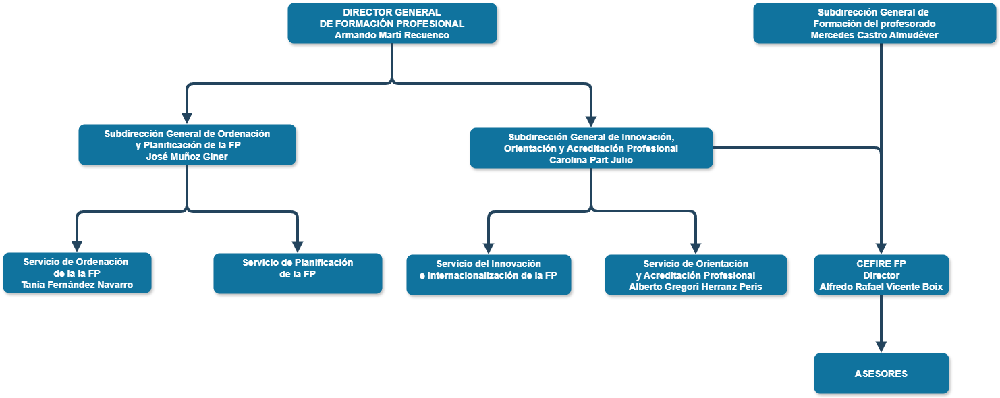

### 🏛 Organigrama

L’organització del **CEFIRE de FP** està estructurada per assegurar una coordinació eficaç entre els assessors, els centres de formació i la Direcció General de Formació Professional.

{: .center}

---

### 👥 Qui som

| Assessor | E-mail | Famílies professionals i càrrecs | Coordinadores de família |
| --- | --- | --- | --- |
| Alfredo Rafael Vicente Boix | [ar.vicenteboix@edu.gva.es](mailto:ar.vicenteboix@edu.gva.es) | DIRECCIÓ COORDINADOR DE PAF | |
| Maria Gloria Muñoz González | [mg.munozgonzalez@edu.gva.es](mailto:mg.munozgonzalez@edu.gva.es) | Informàtica i comunicacions HABILITADA DE GESTIÓ ECONÒMICA COORDINADORA TIC ENCARREGADA DE BANNERS I WEB | Gloria / Santi |
| Jesica Soler Medina | [j.solermedina@edu.gva.es](mailto:j.solermedina@edu.gva.es) | Vidre i ceràmica Imatge personal Tèxtil, confecció i pell | Jesica / José Carlos |
| Iván Gamiz Viosca | [i.gamizviosca@edu.gva.es](mailto:i.gamizviosca@edu.gva.es) | Instal·lació i manteniment Energia i aigua Indústries extractives | Iván / Patri |
| Vera Felip Orus | [v.feliporus@edu.gva.es](mailto:v.feliporus@edu.gva.es) | Sanitat Arts gràfiques Arts i artesanies | Vera / Lorena |
| Francisco Javier Mañó Frasquet | [fj.manofrasquet@edu.gva.es](mailto:fj.manofrasquet@edu.gva.es) | Imatge i so Agrària Marítim pesquera | Paco / Anna |
| Lorena Muñoz Català | [l.munozcatala@edu.gva.es](mailto:l.munozcatala@edu.gva.es) | Química Indústries alimentàries Seguretat i medi ambient | Lorena / Vera |
| Santiago Peiró Turpín | [s.peiroturpin@edu.gva.es](mailto:s.peiroturpin@edu.gva.es) | Electricitat i electrònica Edificació i obra civil | Santi / Gloria |
| Jose Carlos Denia Abad | [jc.deniaabad@edu.gva.es](mailto:jc.deniaabad@edu.gva.es) | Transport i manteniment de vehicles Fabricació mecànica Fusta, moble i suro | José Carlos / Jesica |
| Patricia Fuster Fort | [p.fusterfort@edu.gva.es](mailto:p.fusterfort@edu.gva.es) | Administració i gestió Comerç i marketing IPE | Patri / Iván |
| Anna Guasp Vidal | [a.guasp@edu.gva.es](mailto:a.guasp@edu.gva.es) | Hoteleria i turisme Activitats físiques i esportives Serveis socioculturals i a la comunitat | Anna / Paco |

---

### ⏰ Horari d’atenció de cada assessoria

* **Atenció presencial i virtual:** de dilluns a divendres, de 8:30 a 14:30.  

---

### 🏫 Directori de centres i directors

Per a facilitar la comunicació amb els centres de FP, amb els directors o amb els cap de departament de cada familia professional en el següent enllaç podreu trobar difrents directoris:

* Llistat dels centres de FP de la Comunitat Valenciana
* Directori de directors(es) de centres
* Directori de caps de departament
* ...

[:material-link-variant: Directori de Contactes]({{enlaces.directori_contactes}}){: .md-button target="_blank"}

---

## 🎨 Imatge corporativa

L’aplicació correcta de la **imatge corporativa** és fonamental per a mantenir la coherència i professionalitat de la nostra comunicació. En el Teams podràs trobar:

* Logos oficials
    - Disponible en formats **PNG, JPG i vectorial (SVG)**.
    - Ús recomanat: documents oficials, presentacions, comunicació interna i externa.

* Plantilles
    - Plantilles oficials per a documents (Word i PowerPoint).

* Firma de correu electrònic

* Fons per a Teams per a videoconferències amb identitat corporativa.

* Fons per a formularis de Microsoft Forms

[:material-link-variant: Image Coorporativa]({{enlaces.image_corporativa}}){: .md-button target="_blank"}

---
