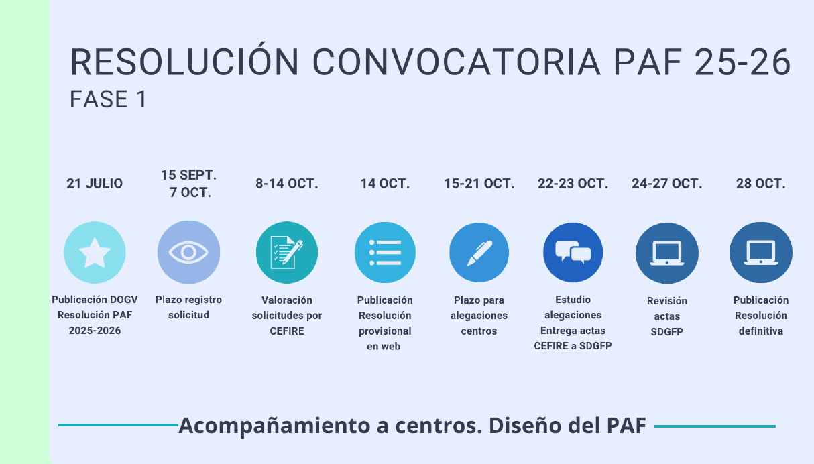

## Llistat PAF Assesor vs Centre Asignat
[:material-microsoft-excel: Llistat PAF Assesor vs Centre Asignat]( {{enlaces.llistat_excel_paf}} ){: .md-button target="_blank"}

## Organització de la formació
- **PAFP (Pla Anual de Formació Permanent del Professorat):** document marc de Conselleria que fixa les línies generals de formació.  
- **PAA (Pla Anual d’Actuació dels CEFIRE):** concreció anual de la programació formativa de cada CEFIRE.  
- **PAF (Pla Anual de Formació):** planificació formativa anual de cada centre educatiu.  

---

## PAF (Pla Anual de Formació)

Conjunt d’activitats formatives que un centre educatiu planifica i desenvolupa al llarg del curs.  

**Rols implicats:**  
    - **CFC** (Coordinador/a de Formació de Centre): persona responsable de coordinar el PAF en cada centre.  
    - **CAF** (Coordinador/a de l’Acció Formativa): responsable de l’organització i seguiment de cada activitat formativa concreta.  

**Té 3 fases principals:**

1. Elaboració i sol·licitud del PAF (setembre-octubre)
2. Desenvolupament de les activitats formatives (novembre-juny)
3. Memòria i tancament (juliol)

## Cronograma elaboració del PAF (Convocatòria 25-26)

## Elaboració i sol·licitud del PAF (amb ITACA3)

| Pas | Tasques principals | Participants implicats |
|-----|-------------------|-------------------------|
| 1   | Detecció i anàlisi de les necessitats formatives del professorat i del centre | CFC · Direcció · Claustre |
| 2   | Concreció del PAF i introducció de les necessitats formatives i persones CAF de les AF a **ITACA3** | CFC |
| 3   | Definició i introducció de les persones participants i presentació de l’AF | CAF |
| 4   | Acceptació de la cessió d’espais i aprovació amb data de claustre | Direcció · Secretaria |
| 5   | Presentació oficial del PAF | CFC |

!!!note "**Nota:**"
    Les persones participants han d’acceptar o declinar la participació mitjançant **OVIDOC**.

---
## Elaboració i sol·licitud del PAF (No ITACA3)

| Pas | Tasques principals | Participants implicats |
|-----|-------------------|-------------------------|
| 1   | Detecció i anàlisi de les necessitats formatives del professorat | CFC · Direcció · Claustre |
| 2   | Concreció del PAF i introducció de les necessitats formatives i persones CAF de les AF | CFC |
| 3   | Definició i introducció de les persones participants i presentació de l’AF | CAF |
| 4   | Acceptació de la cessió d’espais i aprovació amb data de claustre | Direcció · Secretaria |
| 5   | Presentació oficial del PAF | CFC |

**Documents necessaris:**  
- Sol·licitud del Programa d’Activitats Formatives (PAF)  
- Projecte de Formació en Centres (PFC)  
- Seminari (SEM)  
- Grup de Treball (GT)  

---

## Modalitats formatives

| Modalitat                        | Definició                                                                                     | Participants | Ponents                        | Hores  |
|----------------------------------|-----------------------------------------------------------------------------------------------| -----|--------------------------------|--------|
| **Projecte de Formació en Centres** | Disseny i posada en pràctica d’actuacions de millora en processos d’ensenyament-aprenentatge | PUC.- Mínim 50% del claustre   PIC.- 50% del claustre coordinador + 30% del claustre participant  | - Interns < 60%   - Externs ≤ 30%   - Interns + externs < 60% | 30-60 |
| **Seminari**                     | Reflexió, anàlisi, debat i estudi compartit de qüestions tècniques, educatives o didàctiques  | 7 - 15 persones   | - Interns < 60%   - Externs ≤ 30%   - Interns + externs < 60%  | 20-30 |
| **Grup de Treball**              | Elaboració i/o anàlisi de materials curriculars i la seua experimentació en situacions reals  | 5 - 10 persones  | No  | 20-30 |

<i>PUC.- Centre únic</i>  
<i>PIC.- Intercentres</i>
  
    
* La partida econòmica que s’ingressa en el compte dels centres sols es podrà utilitzar en formació, incloent el romanent d’altres anys.  
* El pressupost es d'1.000.000€.  
* El centre coordinador és el gestor de l'assignació econòmica.  

### Temàtiques

#### Temàtiques Prioritaries
  * Competència lectora i escriptora
  * Competència matemàtica
  * Pensament computacional, programació, robòtica i intel·ligència artificial  
  * Sostenibilitat ambiental  
  * Internacionalització  
  * Gestió i actuacions en cas d’emergència  

#### Temàtiques Estratègiques
  * Competències professionals docents:  
      ⚬ Ensenyament i aprenentatge  
      ⚬ Desenvolupament integral i benestar emocional de l’alumnat i el professorat  
      ⚬ Compromís professional  
      ⚬ Direcció i lideratge  
      ⚬ Gestió i actuacions en cas d’emergències  
  * Formació relacionada amb les etapes de desenvolupament de la carrera professional:  
      ⚬ Formació bàsica. Dirigida al professorat novell  
      ⚬ Formació contínua. Dirigida a l’actualització docent  
      ⚬ Formació especialitzada. Dirigida a càrrecs de direcció i coordinació d’equip i projectes  

#### Possibilitats de certificació de diferents formacions combinades per participant

|                          | **Projecte de Formació en Centres (PFC)** | **Seminari** | **Grup de Treball**  |
|-----------------------------------|-------|-------|-------|
| **Projecte de Formació en Centres (PFC)** | SÍ (si són de 30 hores) | SÍ | SÍ |
| **Seminari**                      | SÍ | NO | SÍ |
| **Grup de Treball**               | SÍ | SÍ | NO |

Un participant podrà certificar 1 o 2 PFCs (si són de 30 hores), un seminari i un grup de treball

Hores que pot certificar un participant

| Modalitat                         | Mínim | Màxim |
|-----------------------------------|-------|-------|
| **Projecte de Formació en Centres (PFC)** | 30 h  | 60 h (per any escolar) |
| **Seminari**                      | 20 h  | 30 h (per any escolar) |
| **Grup de Treball**               | 20 h  | 30 h (per any escolar) |

---

## Guia d'AF relacionades amb IA
Guia d'Accions Formatives relacionades amb Intel·ligència Artificial.  
Els centres que vulguen fer formació en el marc del PAF relacionada amb IA, ho han de fer seguint aquesta [guia]({{enlaces.guia_IA}}){target="_blank"}.

---

## Funcions del CFC i del CAF

#### Funcions del CFC
- **Fase 1:** detecció de necessitats, introducció a ITACA3, selecció de CAF i presentació del PAF.  
- **Fase 2:** suport, supervisió i seguiment de les activitats formatives.  
- **Fase 3:** avaluació del PAF i elaboració de la memòria.  
- Coordinació amb el CEFIRE de referència.  

#### Funcions del CAF
- **Fase 1:** registre i planificació de l’activitat formativa a ITACA3, introducció de participants i ponents, presentació de l’AF.  
- **Fase 2:** desenvolupament de les sessions, control d’assistència, redacció d’actes i càrrega a ITACA3.  
- **Fase 3:** tancament de l’activitat i presentació de la memòria final.  
- Coordinació amb el CFC.  

---

## Informació destacada
- Assignació econòmica: es demana la diferència entre necessitats i romanent.  
- PAF: L'ha de aprovar el claustre (model de certificat a la pàgina web de Conselleria).També cal informar al Consell Escolar.
- Els centres poden oferir fins a **dos PFC de 30h** si hi participa el 50% del claustre en cadascun.  
- Participants: Transcorregut el 15% de les sessions NO S’ADMETRAN CANVIS EN ELS PARTICIPANTS

---

## Manuals
Manuals disponibles segons el rol i la modalitat:

[:material-folder: Carpeta Manuals PAF]( {{enlaces.carpeta_manuals_paf}}){: .md-button target="_blank"}

* **[ CFC ]({{enlaces.carpeta_manual_cfc}}){: target="_blank"}**: concreció del PAF, supervisió i finalització.
* Planificació i presentació **[ PROJECTE DE FORMACIÓ CENTRES ]({{enlaces.planificacio_pfc}}){target="_blank"}**  
* Planificació i presentació **[ SEMINARI / GRUP DE TREBALL ]({{enlaces.planificacio_semintari_grup}}){target="_blank"}**
* **[Secretaria]({{enlaces.paf_secretaria}}){target="_blank"}:** certificació d’AF i presentació del PAF.  
*  **[Manual Gesform Fase I]({{enlaces.manual_fase_I}})**
*  **[Manual Gesform Fase I]({{enlaces.manual_fase_II}})**

---

## Normativa
- **[Resolució 15 juliol 2025:]({{enlaces.resolucio_PAF}}){target="_blank"}** Programa Anual de Formació (PAF).  
- **[Resolució 22 maig 2025:]({{enlaces.resolucio_PAFP}}){target="_blank"}** Pla Anual de Formació del Professorat (PAFP).  
- **[Orde 65/2012:]({{enlaces.ordre65}}){target="_blank"}** model de formació permanent del professorat.  

---

## Curs d’acompanyament CFC
- Curs **obligatori** per als CFC. [Enllaç al curs]({{enlaces.curs_acompanyament_cfc}}){target="_blank"}  
- Objectiu: acompanyament en totes les fases del PAF.  

