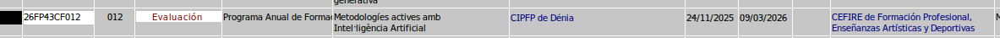
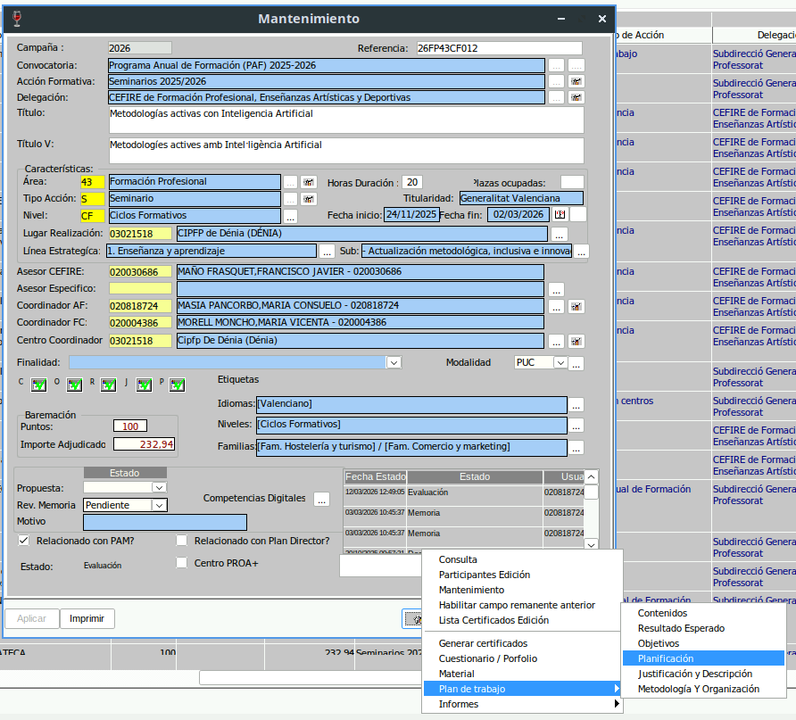
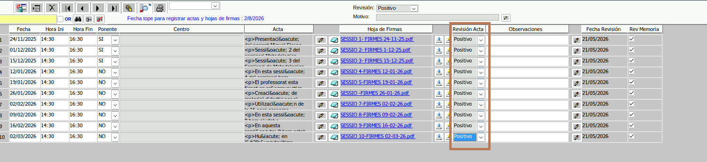
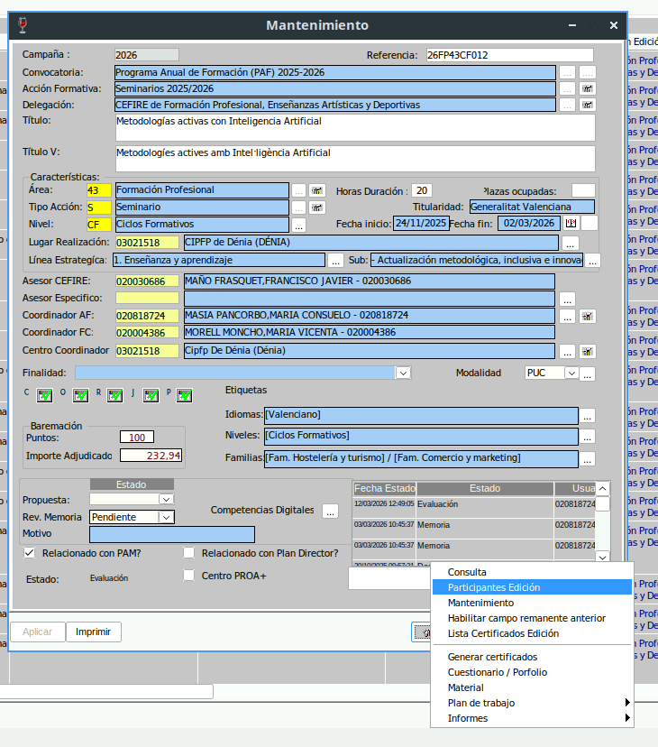
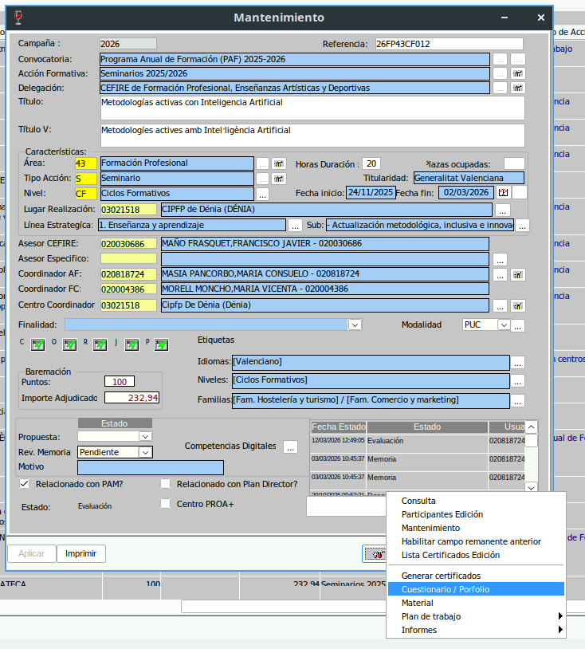
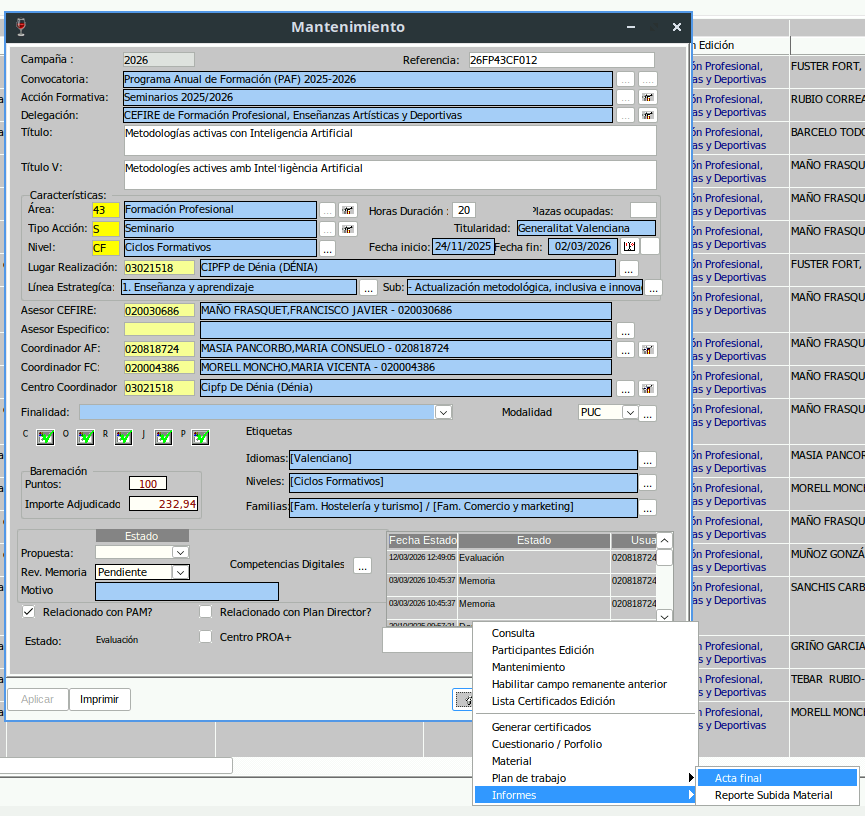
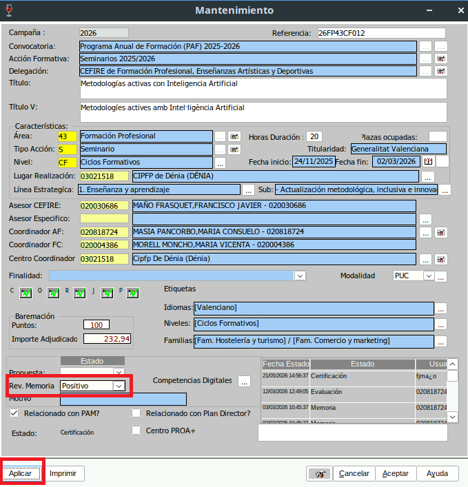
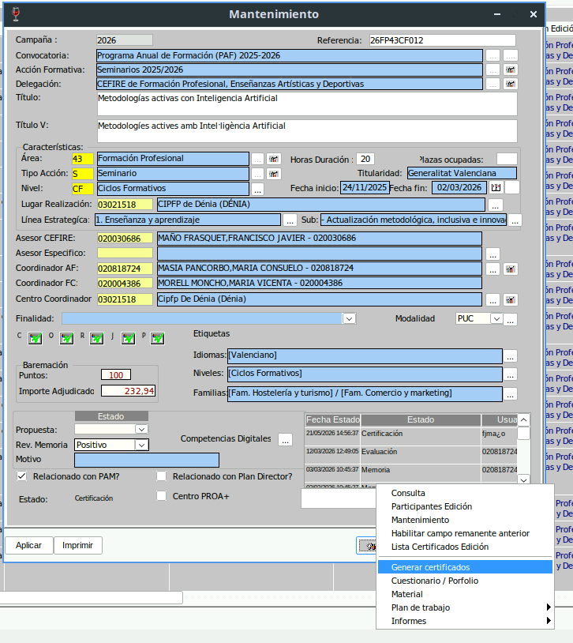
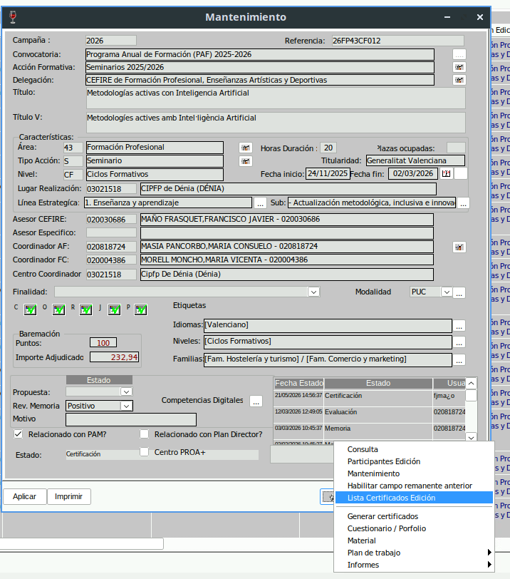
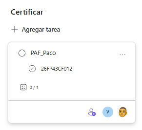

# Certificació d'una AF del PAF

Aquest tutorial descriu el procediment per a revisar, validar i certificar una **acció formativa (AF) del PAF**.

!!! warning "Condició prèvia"
    Per a poder certificar una AF del PAF, la formació ha d'estar en estat **Evaluación**.

{.center }

!!! note "Estat Memoria"
    Si la formació està en estat **Memoria**, que és l'estat previ a **Evaluación**, podem demanar al **CAF** que ens avise. Així podrem revisar la documentació abans que l'AF avance en el procés de certificació.
    

---

## 1. Comprovar la planificació

El primer pas és entrar en l'apartat de **Planificación** (Extintor/Plan de Trabajo/Planificación) i revisar que tota la documentació de seguiment està correcta.

{.center }


Cal comprovar:

* Que estan totes les **actes** de les sessions.
* Que les actes estan correctament emplenades.
* Que estan totes les **fulles de signatures**.

En les **fulles de signatures** s'ha de revisar:

* Que la **data d'impressió** de la fulla és la mateixa que la data en què es va realitzar la sessió de formació.
* Que el **CAF ha signat** en la part superior de la fulla.
* Quines persones **no han signat**, per a comprovar que consten com a **No aptes** i que, per tant, no certificaran.

Una vegada estiga tot revisat, cal posar **Positivo** en la columna **Revisión del Acta** y aplicar.

{.center }


---

## 2. Revisar els participants

El segon pas és anar a **Participantes edición** (Extintor/Participantes edición) per a comprovar els participants **Aptes** i **No aptes**.

{.center }

Cal revisar:

* Que les persones que han superat la formació consten com a **Apto**.
* Que les persones que no han assistit o no compleixen els requisits consten com a **No apto**.
* Que no queda cap participant amb una qualificació incorrecta.

Si en l'AF hi ha **ponent**, també cal comprovar:

* Que les hores de la ponència són les correctes.
* Que el títol de la ponència està escrit en **valencià** i en **castellà**.

---

## 3. Consultar la memòria

El tercer pas és consultar la **memòria** de l'AF (Extintor/Cuestionario-Portfolio).

{.center }


Quan s'accedeix a aquest apartat, s'obrirà una nova finestra del navegador per a poder revisar el qüestionari.

Cal comprovar:

* Que el qüestionari està totalment emplenat.
* Que no hi ha respostes en blanc.
* Que la informació introduïda és coherent amb el desenvolupament de l'AF.

S'ha de posar especial atenció a les dues últimes qüestions:

* **Aspectos que mejorar de la AF**
* **Aspectos que destacar de la AF**

Cal llegir-les per si el CAF ha indicat alguna informació rellevant que s'haja de tindre en compte abans de certificar.

---

## 4. Traure i signar l'acta final

El quart pas és generar l'**acta final** de l'AF.

{.center }

!!! warning "Important"
    En les AF del PAF **no s'han de posar logos** en l'acta final.

La nomenclatura de l'arxiu serà:

```text
codiformacio_centre.pdf  

Example.-  
26FP43CF012_CIPFP Denia.pdf

```

Una vegada generada l'acta:

1. Cal revisar que les dades són correctes.
2. **Cal signar-la digitalment**.
3. Cal guardar-la en la carpeta de Teams

[:material-folder: Carpeta Actes Finals Signades]( {{enlaces.carpeta_actes_finals}} ){: .md-button target="_blank"}


---

## 5. Validar l'AF i la memòria

El quint pas és validar l'AF i la memòria per a fer-ho haurem de canviar la revisió de la memòria de l'AF.

Cal posar **Rev.Memoria** en **Positivo**, i aplicar.

{.center }

---

## 6. Generar els certificats

El sext pas és generar els certificats de la formació.

{.center }

Cal seguir aquest procediment:

1. Premer **Generar certificados**.
2. Seleccionar els tipus de certificats que vols emetre.
3. Seleccionar els participants dels quals vols generar els certificats. Normalment serà tots.
4. Generar els certificats.

!!! info "Certificats pendents"
    Si algun certificat apareix com a **certificado pendiente**, no cal fer cap actuació. Gesform executa un script totes les nits que resol aquest problema i genera els certificats pendents.

Quan els certificats estiguen generats, cal comprovar que apareixen correctament en Extintor / Lista certificados edición

{.center }

---

## 7. Solicitar certificació final del director

L'últim pas és informar en **Kanban** que l'AF ja està revisada per a que el director ens certifique l'AF.

Cal crear una targeta dins del dipòsit de **CERTIFICAT** amb aquesta estructura:

* **Títol de la targeta:** `PAF_nom_assesor`
* **Tasques de la targeta:** codi de l'AF certificada
* **Asignar a Alfredo**

{.center }


## Vídeo tutorial

[:material-video: Obrir vídeo tutorial](https://gvaedu-my.sharepoint.com/:v:/r/personal/46402871_edu_gva_es/Documents/Grabaciones/Reuni%C3%B3%20de%20seguiment.%20Programaci%C3%B3%20d%27oferta%20Skills%20per%20a%20novembre.-20260521_115203-Grabaci%C3%B3n%20de%20la%20reuni%C3%B3n.mp4?csf=1&web=1&e=eH2AJY&nav=eyJyZWZlcnJhbEluZm8iOnsicmVmZXJyYWxBcHAiOiJTdHJlYW1XZWJBcHAiLCJyZWZlcnJhbFZpZXciOiJTaGFyZURpYWxvZy1MaW5rIiwicmVmZXJyYWxBcHBQbGF0Zm9ybSI6IldlYiIsInJlZmVycmFsTW9kZSI6InZpZXcifX0%3D){: .md-button target="_blank"}
