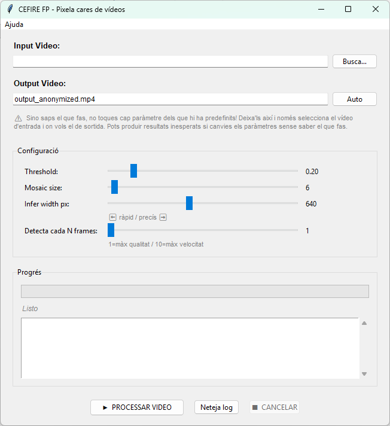

# **Anonimització de vídeos amb DefaceCefire**

**DefaceCefire** és una aplicació que permet **detectar i pixelar automàticament les cares** en un vídeo, garantint la privacitat de les persones.

Aquesta eina és especialment útil per a:

* Publicar vídeos educatius.
* Compartir enregistraments de jornades o sessions.
* Complir amb la normativa de protecció de dades.

[Descarregar aplicació pixelar cares DefaceCefire]( {{enlaces.deface}}){: .md-button target="_blank"}  

---

### Seleccionar el vídeo

El primer pas és indicar quin vídeo volem processar.

1. En el camp **Input Video**, fes clic en el botó **“Busca…”**.
2. Selecciona el vídeo des del teu ordinador.

{: .center}

---

### Definir el vídeo d’eixida

En el camp **Output Video** pots indicar el nom del fitxer resultant.

* Per defecte apareix com `output_anonymized.mp4`.
* Pots modificar-lo manualment.

!!!warning "Compte!"
    Assegura’t de guardar el fitxer en una ubicació coneguda per a poder trobar-lo després.

---

### Configuració (opcional)

!!!warning "Recomanació"
    Si no tens experiència, és millor **no modificar els paràmetres per defecte**, ja que estan ajustats per a obtenir bons resultats.

Si necessites ajustar el comportament, tens aquestes opcions:

**Threshold**.- Controla la sensibilitat de detecció de cares.

* Valors baixos → més deteccions (pot incloure falsos positius).
* Valors alts → menys deteccions.  

**Mosaic size**.- Defineix la mida del pixelat.

* Valor alt → pixelat més gran (més anonimització).
* No influeix en la rapidesa de processament.

**Infer width px**.- Resolució interna del processament.

  * Més gran → millor qualitat però més lent.
  * Més menut → pitjor qualitat però més ràpit. Pot fer que algunes cares menudes no es pixelen.

**Detecta cada N frames**.- Indica cada quants frames (cada quantes imatges) es fa la detecció.

  * 1 = màxima qualitat (més lent)
  * 10 = més ràpid (menys precís)

---

### Processar el vídeo

Quan ja tens tot configurat:

1. Fes clic en el botó **“▶ PROCESSAR VIDEO”**.
2. L’aplicació començarà a treballar.

Durant el procés:

* Veureu una barra de **progrés**.
* En el quadre inferior apareixerà informació del procés (logs).

---

### Finalització

Quan el procés acaba:

* Apareixerà l’estat **“Listo”**.
* El vídeo anonimitzat es guardarà en la ruta indicada.

---

### Altres opcions

* **Neteja log** → esborra la informació del procés.
* **Cancelar** → atura el processament (si està en marxa).

---

!!!danger "Important"
    Revisa sempre el vídeo final abans de publicar-lo per assegurar-te que:  
        * Totes les cares han sigut correctament pixelades.  
        * No hi ha errors en el processament.
