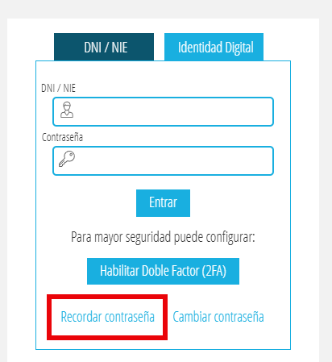
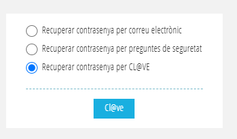
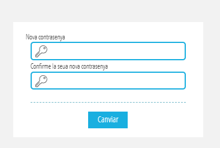
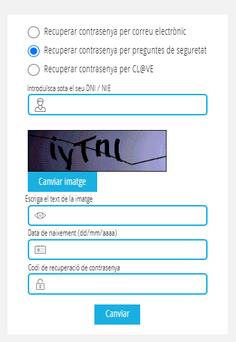

# Recuperar la contrasenya d'Aules / OVIDOC / ITACA

L'autenticació d'**Aules** es realitza amb el mateix usuari que **OVIDOC** i/o **ITACA**.

Si al intentar fer login Aules indica que ja disposes d'usuari però no recordes la contrasenya, hauràs de **reiniciar-la tu mateix/a**, ja que per motius de seguretat no ho podem fer nosaltres.

!!! info "Usuari d'accés"
    L'**usuari** és el teu **DNI amb lletra**.

Per a recuperar la contrasenya d'**Aules**,**OVIDOC** i/o **ITACA**, ho has de fer des de la pàgina d'ITACA:

<https://itaca.edu.gva.es/itaca/Main.html?debug=true>

Una vegada dins de la pàgina, fes clic en **«Recordar contraseña»**.

{.center }

Després t'aparixerà una finestra amb e mètodes per a recuperar la contrasenya.

* Recuperar la contrasenya mitjançant CL@VE (recomanat)
* Recuperar la contrasenya per correu o preguntes de seguretat
* Recuperar la contrasenya per preguntes de seguretat

{.center }

---

## Recuperar la contrasenya mitjançant CL@VE (recomanat)

Si disposes de **certificat digital**, pots fer clic en **«Recuperar contrasenya per CL@VE»**.

1. Accedeix a l'opció **Recuperar contrasenya per CL@VE**.
2. Identifica't amb el teu **certificat digital**.
3. Apareixerà la pantalla des d'on podràs **establir una nova contrasenya**.

{.center }

!!! tip "Mètode recomanat"
    Aquest és el mètode **més ràpid i senzill** si disposes de certificat digital.

---

## Recuperar la contrasenya per preguntes de seguretat

Si no disposes de certificat digital, també pots recuperar la contrasenya **per preguntes de seguretat**.

En el camp **«Codi de recuperació de contrasenya»** has d'introduir: **Els 6 últims dígits del DNI** + **Els 6 últims dígits del compte bancari**.

{.center }

Una vegada introduïdes les dades, podràs **crear una nova contrasenya**.

---

## Recuperar la contrasenya per correu

Has de seguir les instruccions que t'arriben per correu.
